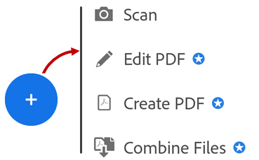
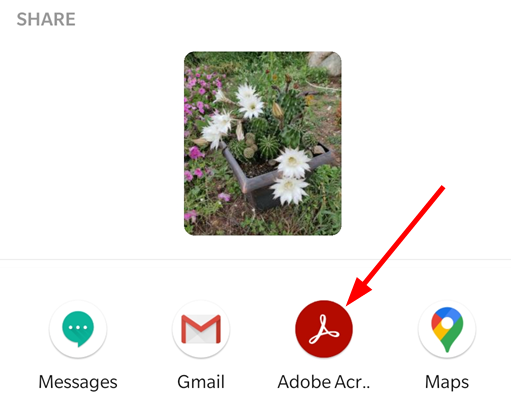
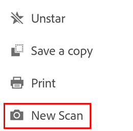

# Create PDF and Scan {#create-pdf-and-scan}

Subscribers to Adobe Acrobat Premium or Adobe Acrobat Pro DC can convert many document types to PDF format. This online service requires an internet connection. 

## Converting unopened files {#converting-unopened-files}

Convert unopened files to PDF as follows:

1. Log in to Document Cloud.
1. Go to any file list (Home, Files, Shared).
1. Do one of the following:

    * For any file, tap  **Create PDF**. 
    * Tap  and then tap 

   

1. Tap any file location, and navigate to a file.
1. Select one non-PDF file.

The app automatically converts your file to PDF. Local files save to Document Cloud. Other files save to their original location.

## Saving a gallery image as PDF {#saving-a-gallery-image-as-pdf}

You can easily convert any image file on your device if the viewing application supports sharing that file with Acrobat Reader.

1. Open an image file in your photo gallery or any other image file on your device.
1. Tap .
1. Tap **Convert to PDF**.

   

## Scanning to PDF {#scanning-to-pdf}

If you've installed the [Adobe Scan app](https://play.google.com/store/apps/details?id=com.adobe.scan.android&hl=en_US), you can invoke it from Acrobat Reader, scan a document, and automatically convert it to PDF. The file is automatically sent to Adobe's Create PDF service and uploaded to Document Cloud.

The free Adobe Scan PDF scanner app turns your device into a powerful portable PDF scanner that recognizes text automatically (OCR). Adobe Scan turns anything — receipts, notes, documents, photos, business cards, whiteboards — into an Adobe PDF with text you can reuse from each PDF and photo scan. 

In addition to creating PDFs which you can then import into Acrobat Reader, Adobe scan allows you to: 

* Edit your scan
* Add images from your device
* Reorder pages
* Crop pages
* Adjust the color
* Rotate pages
* Delete pages

### Scanning from the Home view {#scanning-from-the-home-view}

When in the Home view, simply choose New Scan from the Tools list. 

   

### Scanning from a file list {#scanning-from-a-file-list}

To invoke the scan app: 

1. Log in to Document Cloud.
1. Go to any file list (Home, Files, Shared).
1. Tap  and then tap 
1. When the scan app opens, follow through with the workflow. 

   

### Scanning from an open file {#scanning-from-an-open-file}

You can initiate a scan from any file's context menu: 

1. Open a file. 
1. Tap 
1. Tap **New Scan**. 

   

