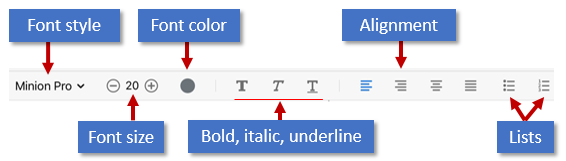
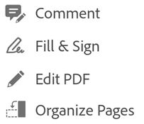
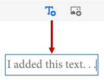
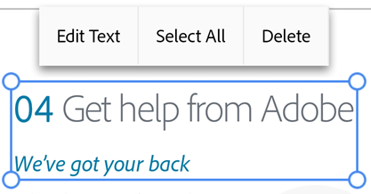
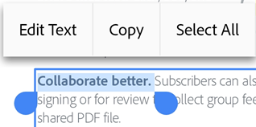
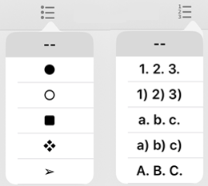
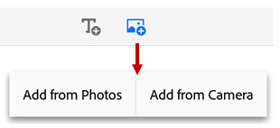

   
# Edit PDF {#edit-pdf}

Subscribers to Adobe Acrobat Premium or Adobe Acrobat Pro DC can edit PDFs on phones and tablets. The edit feature allows you to: 

* Add text and images
* Delete, move, and resize text blocks as well as edit text
* Change the font style, size, weight, color, and alignment
* Convert text to a bulleted or numbered list
* Delete, move, rotate, and resize images
* Undo and redo actions
* Copy and paste text to and from a PDF

## Open edit mode {#open-edit-mode}

To enter edit mode, tap  **> Edit PDF**. 

In edit mode: 

* To edit text or an image, simply tap it. 
* To add a text box or an image, tap  

## Adding text {#adding-text}

To add new text, open edit mode and: 

1. Tap any blank space to show the menu. 
1. Tap 
1. Tap the desired text insertion location.
1. *Optional*: Selet a text formatting tool such as Text, Italic, Underline. 
1. Enter any text.
1. Tap **Save**. 

   

Once you've exited the add text mode, you can tap  the text again and select a tool from the menu to change the font style, size, weight, color, and alignment. 

## Change an entire text block {#change-an-entire-text-block}

To edit existing text, open edit mode and: 

1. Tap a text block. 
1. Optional: Tap **Edit text**, **Select All**, or **Delete**. 
1. Select any text tool from the edit menu. You can change the font style, size, weight, color, and alignment. 
1. Tap outside the edit block to save your change. 

   

## Copy a text block {#copy-a-text-block}

Open edit mode and: 

1. Tap a text block. 
1. Double tap inside the selected text to display the **Copy** menu item.

## Resize a text block {#resize-a-text-block}

Open edit mode and: 

1. Tap a text block. 
1. Drag the text box handles to change the text block's size or location. 

## Editing specific text {#editing-specific-text}

To edit existing text, open edit mode and: 

1. Tap a text block. 
1. Double tap in the text block to show the blow handles. 
1. Drag the handles to select text. 
1. Select any text tool from the edit menu. You can change the font style, size, weight, color, and alignment. 
1. Tap outside the edit block to save your change. 

   

## Inserting lists {#inserting-lists}

You can insert a new list or convert existing text into either a bulleted or numbered list. To do so, simply select text as described above and tap one of the list icons. 

   

## Editing images {#editing-images}

You can delete, resize, rotate and move new and existing images: 

1. Tap  **> Edit PDF**. 
1. Tap an image. 
1. Long press an image and: 

    * Drag it to a different location. 
    * Grab a corner handle and resize the image. 
    * Delete the image. Tap **Delete**. 
    * Tap  to rotate the image.

1. Tap outside the edit block to save your change. 

   

## Adding images {#adding-images}

You can place new image anywhere in a PDF: 

1. Tap  **> Edit PDF**. 
1. Tap 
1. Tap the image location in the document.
1. Tap an image source and navigate to the image. *Available options vary by device*.

   

The app automatically adds the image. 

1. *Optional*. Long press the image to: 

    * Drag it to a different location. 
    * Grab a blue corner handle and resize the image. 
    * Delete the image. Tap **Delete**. 

1. Tap outside the edit block to save your change. 

## Undo-redo {#undo-redo}

You can always undo and redo editing actions. 

* Undo: In edit mode, tap  in the upper right. 
* Redo: Long press the  

   >[!NOTE]
   >
   > When using an external keyboard, you can use the shortcut keys: Command + Z OR Command + Shift + Z
