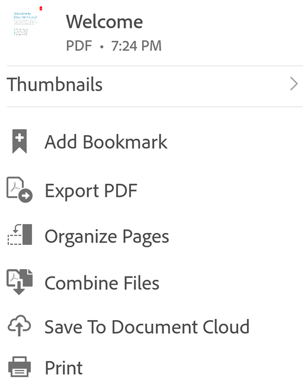
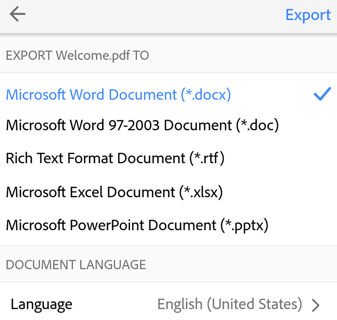
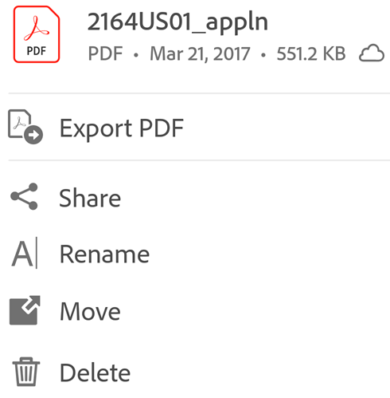

# Export PDF to other formats {#export-pdf-to-other-formats}

Subscribers to Adobe Acrobat Premium or Adobe Acrobat Pro DC can export unshared PDF files to other formats, including Word, Excel, PowerPoint, and rich text. This online service requires an internet connection. 

During the export workflow, users also have the option of converting scanned text into actual text via optical character recognition. Many export languages are supported.

   >[!NOTE]
   >
   > Log in to Document Cloud to use the DC Export service. 

## Exporting an open PDF {#exporting-an-open-pdf}

To export an open (and unshared) PDF:

1. Tap  > 

   

1. Specify an export format (.docx, .rtf, etc.). 
1. *Optional*: By default, the export language is the same as your installed app. You can change the language by tapping **Language** and changing the default. 
1. Tap **Export**.

   

## Exporting an unopened PDF {#exporting-an-unopened-pdf}

You can invoke the export workflow from any file list. 

1. Go to any file list (Home, Files, a search result).
1. Tap  next to any unshared file. 
1. Tap , and complete the workflow described above. 

   
