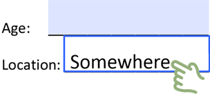
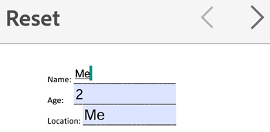
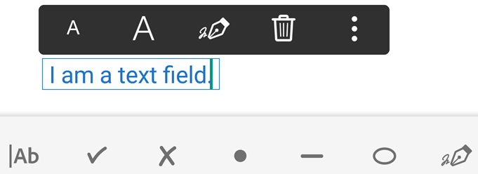

# Work with forms {#work-with-forms}

Acrobat Reader's form related features are richer than ever with support for both traditional Acroforms and Fill & Sign forms. 

## Form type vs. features {#form-type-vs.-features}

There are two main types of forms--Acroforms and Fill & Sign forms--and each has a slightly different set of features. 

* **Acroforms** (traditional forms authored in Acrobat) contain form fields in which you can directly enter data, check boxes, and so on. These can be filled in on any platform and edited in Acrobat. You cannot edit or remove Acroform form fields on a mobile device. 
* **Fill & Sign forms**  are simple forms you can create on any platform, including mobile devices. Fill & Sign form fields are similar to annotations: you can select a form element from the form tool bar and tap anywhere on the PDF to place it. Acrobat also supports adding and editing Fill & Sign form fields. Note that you cannot add Fill & Sign fields to an Acroform. 

## Acroform features {#acroform-features}

### Filling out a form {#filling-out-a-form}

Acroforms already contain form fields. You cannot add or remove form fields from an Acroform. 

* To fill out a form, simply tap a form field.
* After entering data, tap outside a field to save the field data.

### Tabbing through fields {#tabbing-through-fields}

To navigate through fields tap the right or left arrow. 

### Resetting form fields {#resetting-form-fields}

To clear a field: 

1. Select any field.
1. Tap **Reset**.
1. When asked to confirm the reset, tap **Cancel** or **Reset**.

### Bluetooth keyboard navigation {#bluetooth-keyboard-navigation}

To help you use all your devices and peripherals and speed up your use of forms, Acrobat Reader supports Bluetooth keyboard navigation in forms.

### JavaScript API support {#javascript-api-support}

In Acroforms, Acrobat Reader supports the use of JavaScript for form field calculation and validation as well as formatting. For details, see the [Mobile API Reference](https://www.adobe.com/devnet-docs/acrobatetk/tools/Mobile/index.html).

## Fill & Sign features {#fill-&-sign-features}

Fill & Sign features are not available in Acroforms and those PDFs which are signed or security protected. For those PDFs, the Fill & Sign menu bar does not appear.

Fill & Sign provides additional features which streamline form fill-in: 

* Autozoom if the field size is too small for reading. 
* Snapping left when tapping in text fields (LTR locales only). 

### Creating and editing a form {#creating-and-editing-a-form}

You can easily turn almost any PDF into a form and either send it to others or fill it out yourself. 

To create a form in an open document: 

1. Tap   >   to show the Fill & Sign toolbar. 

   

1. Select a form tool; for example, a text field or checkbox. 
1. Enter data. By default, the app suggests entries for text fields.
1. Tap  to exit Fill & Sign mode. 

When you place a form element, a context menu provides options for changing the font size, deleting the element, and so on.

   

   >[!NOTE]
   >
   >  You can copy text from your clipboard to text fields. 

### Automatic form fill-in {#automatic-form-fill-in}

By default, the app uses your form fill-in history to suggest words in  subsequent forms. This feature saves time, especially on a mobile device. Sources for suggestions include the following: 

* Data from saved forms: If the first two letters match data you've entered in past (and saved) forms, suggestions are populated from that usage history. 
* Date formats: Typing the first letter or any number in the current date suggests the following date formats: 8/06/2018; Aug 6, 2018; August 6, 2018.

To disable this feature:

1. Tap  > **Preferences**. 
1. Disable **Suggest previously used words when filling forms**.

   

### Clearing form data history {#clearing-form-data-history}

You usage history is saved from completed forms. This allows the app to make suggestions as you type in form fields. To clear your suggestion history: 

1. Tap  > **Preferences**.
1. Tap **Clear Suggestions > Remove**.

### Signing forms {#signing-forms}

Signing is a simple process, especially if you've already [created your signature](signing.md). Simply tap  and place your signature. 

### Pasting text into text fields {#pasting-text-into-text-fields}

When you copy text to your device clipboard, you can paste that text into a text field by simply long pressing the field and tapping **Paste**. 

### Undo and redo {#undo-and-redo}

As you fill in a form, you can undo and redo any action (except signing). Simply tap or  in the upper right menu or above the keyboard (if it is visible).

   

### Deleting form fields {#deleting-form-fields}

To remove a field: 

1. Tap any field.
1. Tap 

   

## Forms FAQs {#forms-faqs}

**Does Acrobat Reader support XFA forms?**

No. Acrobat Reader cannot open dynamic or static XFA forms created with LiveCycle Designer.

**Is there any LiveCycle integration?**

Acrobat Reader supports files secured by password security via Adobe LiveCycle Rights Management Server as well as document revocation. For details, see the Mobile Enterprise Guide at ``https://www.adobe.com/go/readermobileetk``.

**Why does the form I completed on my device appear blank elsewhere?**

There are several possible reasons:

* Acrobat does not support XFA form fill-in (sometimes created with LiveCycle Designer).
* Many non-Adobe PDF viewers DO NOT SUPPORT viewing form data.

**Why don't I see the form element tools?**

You have opened an Acroform or a signed form. You cannot add form fields to those types of files. 

**Why can't I edit my form?**

Signed forms are locked. 
