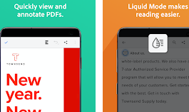

# Getting Started {#getting-started}

Acrobat Reader DC delivers one-click integration with  Adobe Scan and as well as enterprise-class PDF workflow features. Enterprise configuration options support managing your work and personal files as needed. An intuitive user interface works similarly across phones, desktop, and the browser. Now you can start a collaborative review at work, check review status and comment PDFs on the train, and access any PDF workflow on the web. 

*Enterprise administrators* can configure and deploy mobile apps so that  work and personal files are managed separately in secure environments. Other options include controlling access to Adobe Document Cloud as well as  3rd party cloud storage solutions as well as other common settings for both MAM and MDM environments. 

Whether you're at work or on the go, your files are simply accessible whenever you need them: 

* **Mobile**: Manage work and personal files from any location on your phone or tablet. 
* **Web**: Access files on Adobe Document Cloud, Google Drive, Dropbox, or any other location accessible on your device. 
* **Desktop**: Sign in to desktop Acrobat to see all your latest files. 

**Mobile documentation**: [Acrobat for Android](../acrobat-android/index.md) | [Acrobat for iOS](../acrobat-ios/index.md) | [Scan for Android](../scan-android/index.md) | [Scan for iOS](../scan-ios/index.md)

## Top pages

<table>
<tr>
  <td>

<table style="width:200px; float:left;">
<tr>
  <td>
    
    

      <a href="https://www.google.com">
    <strong>Frequently Asked Questions</strong>
    </a>
    

    

    <em>Find answers to common questions and troubleshoot</em>
    

  </td>
</tr>
</table>

<table style="width:200px;float:left;">
<tr>
   <td>
    
    

      <a href="managesubscriptions.md">
    <strong>Manage Subscriptions</strong>
    </a>
    

    

    <em>Add, remove, restore, and monitor your purchases</em>
    

  </td>
</tr>
</table>

<table style="width:200px;float:left;">
<tr>
  <td>
    
    

       <a href="https://play.google.com/store/apps/details?id=com.adobe.reader&hl=en_US&gl=US">
    <strong>Install the Latest App</strong>
    </a>
    

    

    <em>Install the latest build so you can leverage the latest features. </em>
    

  </td>
</tr>
</table>

  </td>
</tr>
</table>

## Signing in {#signing-in}

Signing in is required for features using services, but it also provides many other  advantages: 

* Access to free features that leverage online services
* Access to advanced features which are part of your subscription services
* Enablement of the notification service which alerts you to file changes, workflow updates, review participation, etc. 
* Automatic saving of most file changes in Document Cloud which not only protects your work, but allows file access on any device
* Automatic sign in to both Acrobat and Adobe Scan

You can sign in to Document Cloud with an Adobe, Google/Facebook/Apple IDs, or a supported enterprise credential. 

1. Open the app. 
1. Choose a sign in option: 

* Tap a 3rd party sign in option: Facebook, Google, or Apple.
* Tap **Sign In** to use your Adobe ID, then enter your email address and password.
* Tap **Sign Up** to create a new Adobe ID.

   

### Signing in with a company or school ID {#signing-in-with-a-company-or-school-id}

You likely have a single login credential and will only see one set of screens. However, if you are part of an organization and have another ID, you may be prompted to choose between an personal or company ID. If so, select an account and log in with the credential associated with that account. 

   

### Signing out {#signing-out}

Signing out disables access to subscription services as well as online documents and workflows. 

To sign out, tap  **> Sign Out**.
