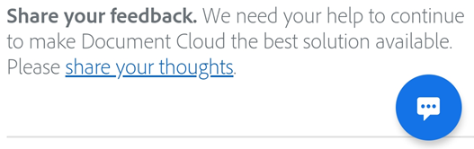

# Liquid Mode {#liquid-mode}

Liquid Mode is a revolutionary mobile reading experience powered by Adobe Sensei, Adobe's artificial intelligence (AI) and machine learning technology. Liquid Mode enhances your PDF layout and adds features on-the-fly to help you easily read documents on your phone and tablet  It's AI technology evolves and improves the Liquid Mode experience as it learns over time.

To use Liquid Mode, simply open any file and tap . 

Liquid Mode provides the following features: 

* A flowable layout that mimics HTML pages on the web
* Tap images to zoom in 
* Linked outline view
* Collapsible content sections (accordion widgets)
* Back to top button at the document end
* And more!

## System requirements {#system-requirements}

* iOS 12 or later
* Android phones 5.0 and later. Android devices with less than 1GB of RAM or x86 processors are not yet supported.
* Chromebook
* **Languages**: Liquid Mode is currently available for English, Spanish, French, German, Dutch, Danish, Finnish, Italian, Norwegian, Portuguese, Spanish, Swedish, Romanian, Catalan

## Compatible files {#compatible-files}

Most files are compatible, but the following limitations may apply: 

* More than 200 pages
* More than 10 MB in size
* Scanned
* Converted from presentations (Microsoft PowerPoint, Apple Keynote, etc.)
* Encrypted or password protected
* Complex layouts (eg. tickets, statements, invoices, receipts etc.). Please view the following PDFs in their original layout for the best experience:

    * Documents containing mostly tables and charts (e.g. spreadsheets)
    * Documents containing mostly images (e.g. illustrations, CAD drawings)
    * Forms
    * Non-standard page sizes such as posters and business cards 

## FAQs {#faqs}

**Can I use Liquid Mode with screen readers and voiceovers?**

Yes.

**Is this experience secure for my data and documents?**

We value your privacy and trust and make it a priority when you use our products. When you use this feature:

* Files are processed in our secure data servers and immediately deleted from our servers after the experience is generated.
* Your files are kept private unless you share them with others. 

To learn more about how we protect your privacy when you use Adobe Acrobat Reader mobile app, please visit [Adobe Privacy Center](https://www.adobe.com/privacy.html).

**Does this experience change your document's content?** 

No, this experience does not change any content. Simply tap on the drop-shaped icon again to revert to your original page view.

**Does this experience change the file format of your document?**

No, this experience does not change the file format of your document.

**Does Liquid Mode work in Dark Mode?**

Liquid Mode does not currently work in Dark Mode but will in the near future. 

## Submitting feedback {#submitting-feedback}

1. Open Liquid Mode.
1. Tap the feedback icon.
1. Select **Provide Feedback**.
1. Rate the feature and/or fill out the feedback form. 
1. Tap **Submit**. 

   
