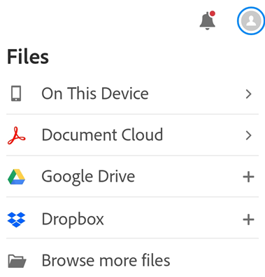
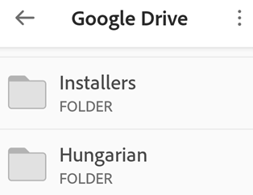
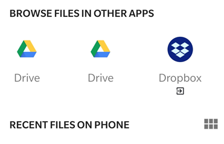
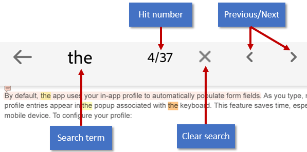
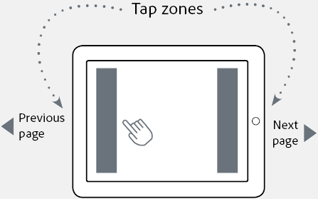
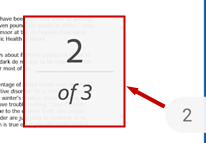
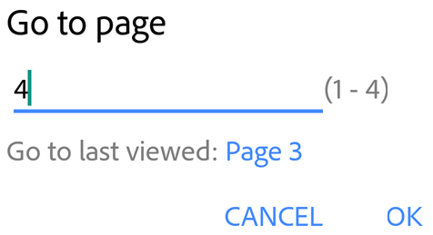
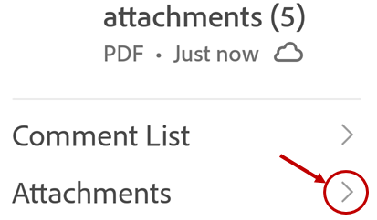
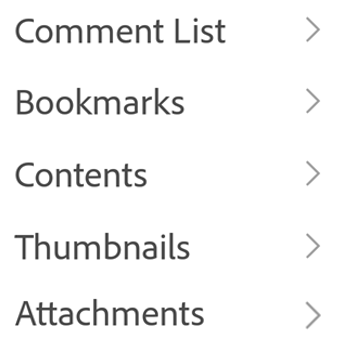

# Navigate and search {#navigate-and-search}

## Finding files {#finding-files}

Acrobat Reader provides a number of ways to help you find files, file content, and folders. When no file is open, the bottom menu displays available locations:

* **Home**: When you start Acrobat, the Home screen shows you all of your files regardless of location with the most recently viewed files at the top of the list. 
* **Files**: The Files list allows you to select a local or cloud based location.
* **Shared**: When you're signed in, the Shared file list displays files shared by you or by others with you. These include both view-only files as well as review files which allow comments. 
* **Search**: Search provides a way to find all the files and file content that match your search parameters.

### Recent files {#recent-files}

To see a list of recently viewed files, tap **Home**. 

### Searching for files {#searching-for-files}

Acrobat searches local and Document Cloud files. It does not search files in other cloud storage locations. Search for a file by title or type as follows: 

1. With no file open, tap 
1. Enter the search term.
1. Tap the keyboard arrow. 

 When the search result appears, you further refine the result by tapping on a file location.

   

## Cloud-based files {#cloud-based-files}

Acrobat Reader integrates with Adobe Document Cloud, Dropbox, and Google Drive so that you can easily work with files in any location. Edited cloud-based PDF on your device automatically save back to the original cloud location.  

Dropbox and Google Drive users can install the apps or simply add their accounts on-the-fly to enable one-touch access to those locations. All scenarios allow you to open cloud-based files in Acrobat Reader and save edited files back to the original location.

   

### Opening file from the cloud {#opening-file-from-the-cloud}

To access your files in Document Cloud, Dropbox, or Drive: 

1. Go to the Home screen.
1. Tap  
1. Tap one of the cloud storage options. If you have not already connected your account, tap **Plus > Add Account**, and complete the workflow.
1. Once you've gained access, you can navigate to any file. PDF files open in Acrobat. If you edit the PDF, changes automatically save back to the cloud. 

   

### Browsing for other files {#browsing-for-other-files}

In addition to accessing files in connected cloud storage locations and other default files lists, you can simply tap **Browse more files** to navigate to storage locations accessible on your device. 

   

## Navigating within files {#navigating-within-files}

### Searching within a file {#searching-within-a-file}

1. Open a file: 

    * Review files: tap  > 
    * Normal and shared files: tap  ** @gt; Find in Document**. 

1. Enter the search term.
1. Tap Search. The first result is highlighted.
1. Tap the right or left arrow in the top bar to show the next or previous occurrence.

   

### Showing menus {#showing-menus}

By default, a menu at the top of an open file displays icons for common tasks. The menu varies based on the  viewing context. For example, items in the top menu bar change depending on whether you're viewing a private file, a shared file, or a review file. 

When a file is open, a single tap changes the view to immersive mode. Immersive mode hides the menus so that you can see more of the document.

### Tap zones {#tap-zones}

If you've set the viewing mode to Page-by-Page view, tap the left and right edges of the screen to jump to the previous or next page.

   

### Jumping multiple pages {#jumping-multiple-pages}

When your PDF document has 3 or more pages:

1. Tap the middle the screen to show the scrubber tab. Depending on your view mode, it will appear on the right side or bottom of the of the screen.
1. Long press the tab and slide to another page. 

   

### Go to page {#go-to-page}

When your PDF document has 3 or more pages:

1. Tap the middle the screen to show the scrubber tab. Depending on your view mode, it will appear on the right side or bottom of the of the screen.
1. Tap the scrubber tab. 
1. Enter a number in the Go To Page dialog. 
1. Tap **OK**.
 
   

### Smart zoom {#smart-zoom}

Double-tap anywhere in your document to zoom into the exact content you want to see. Acrobat Reader analyzes the document and fits the view to the column of text under your tap. Double tap again to zoom out.

   

### Attachments {#attachments}

When a document has attachments, you can navigate to them quickly by using the pop up menus:

1. Tap  ** @gt; Attachments**.
1. Tap an attachment to view it. If it's not a PDF, you'll be prompted to open it in a supported app. 
1. Tap **Back** to return to the main document.

   

### Viewing the navigation menu {#viewing-the-navigation-menu}

In a PDF, tap  to show the action menu with links to items in the document. If they exist, then the menu provides links to: 

* Comments
* Bookmarks
* Table of contents
* Thumbnails
* Attachments

   

### Viewing bookmarks {#viewing-bookmarks}

If a document contains bookmarks, an icon appears in the lower right toolbar.

1. Tap the PDF to show the menus.
1. In a PDF, tap 
1. Tap **Bookmarks**.
1. Navigate through the bookmarks, and tap the one you need to open the specified page.

### Adding and removing bookmarks {#adding-and-removing-bookmarks}

1. When viewing a page you'd like to bookmark, tap the PDF to show the menus.
1. In a PDF, tap 
1. Tap  or 

   >[!NOTE]
   >
   > Only 1 bookmark can be added per page.

### Viewing a table of contents {#viewing-a-table-of-contents}

1. Tap the PDF to show the menus.
1. In a PDF, tap 
1. Tap **Contents**.
1. Navigate through the table of contents, and tap the topic you need to open the specified page.

### Viewing a comments list {#viewing-a-comments-list}

Files in an open review may content a list of reviewer comments. To view the comments: 

1. Tap the PDF to show the menus.
1. In a PDF, tap 
1. Tap **Comments List**.
1. Navigate through the comments, and tap the one you need to open the specified page.

