# Sharing & Reviewing files {#sharing-&-reviewing-files}

Acrobat Reader provides a rich set of file share and review features as well as tools for managing both. Review service subscribers can share files in review mode so that it's easy to collaborate and collect feedback on any file. Highlights include: 

* Sharing view-only files  (free) or sharing files for review (subscription) so that recipients can comment and markup files
* A **Share** user interface and feature set that's similar across the desktop, web, and mobile devices
* Always synchronized files across any connected device
* Easy controls for creating, participating in, and managing reviews 
* Real-time notifications of file views, changes, and participation as well as support for @mention tags

## Sharing a PDF {#sharing-a-pdf}

Sharing files is as simple as tapping  and completing the share workflow. Sharing requires an internet connection.

   >[!NOTE]
   >
   > For details about sharing and review workflows, see [Sharing Files and Starting Reviews](review.md). 

1. Open a PDF. If the top menu is not visible, tap the document. 
1. Tap 
1. Add 1 or more email addresses.
1. *Optional*: Tap the subject line and/or message text box to edit them.
1. *Optional*: If you're sending the file for review, enable **Allow comments for review**. View files are read-only. Review files allow recipients to add comments and annotations. 
1. Choose **Send**.

The file automatically uploads to Document Cloud. Document recipients can access the file from the web as well as their desktop or phone. Alternatively, you can also share a link to the file or a copy of the file. 

   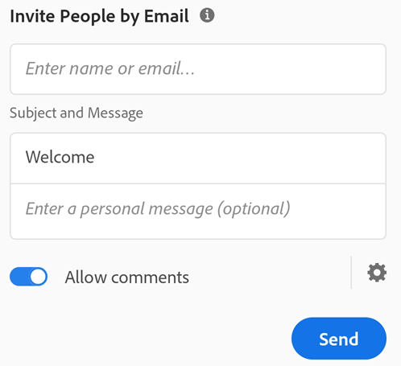

   >[!NOTE]
   >
   > For details about sharing workflows, see [Sharing Files and Starting Reviews](review.md). 

### Sharing a link or file copy {#sharing-a-link-or-file-copy}

Share options include sharing the actual file or sharing a link to the file. 

* Sharing a link saves bandwidth and provides access to files stored in the cloud. 
* Sharing the actual file may save users time and provides alternate ways to deliver the file. For example, you can send a file as an email attachment. 

To do so, use the Share method described above and tap  **Get a Link** or **Share a Copy**.

   >[!NOTE]
   >
   > If you don't enter any email addresses prior to choosing **Get a Link** or **Share a Copy**, the app invokes your app list. You can then email the file, save a copy to Google Drive, or share the file with any supported app you've installed. 

   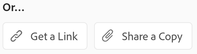

### Share tag {#share-tag}

You can easily determine if a file is shared from the Home view or the file context menu. Shared files are marked with a group icon. When you search for a file, the tag also appears in the search result. 

   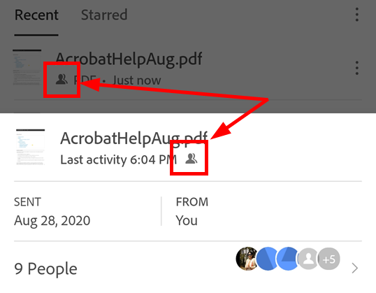

### Shared "by you" and "by others" {#shared-"by-you"-and-"by-others"}

When no document is open, you can view all your shared files from the Shared view. The Shared file list shows all files grouped by **By Others** and **By You**. 

1. Tap  to view your shared files.  
1. Tap either **By Others** or **By You** tabs to see your separate file lists. 

   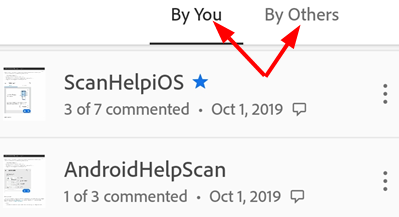

## Commenting {#commenting}

Commenting is a free service, and you can easily add notes and mark up files: 

1. Open PDF
1. Tap 
1. Tap **Comment**
1. Tap a tool in the comments tool bar.
1. Place your markup in the document.
1. Tap **Post**.

You can reply to comments, change the color, delete comments, and view all comments. 

   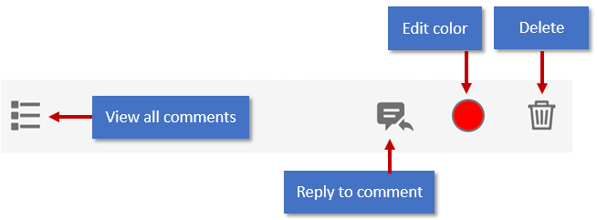

Navigate through comments by viewing all comments and scrolling through the list or by using the previous and next arrows.

   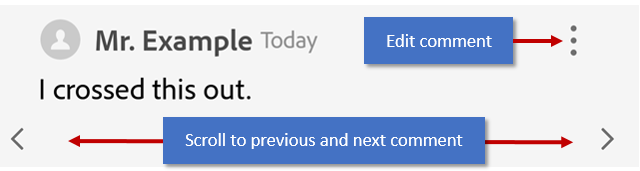

   >[!NOTE]
   >
   > For details about review workflows, see [Sharing Files and Starting Reviews](review.md). 

## Initiating a share or review {#initiating-a-share-or-review}

Sharing a file is easy, and you can track and manage the share from your mobile device, the desktop, and the web. You'll receive push notifications when reviewers participate. 

1. Open a PDF. If the top menu is not visible, tap the document. 
1. Tap 
1. Add 1 or more email addresses.
1. *Optional*: Tap the subject line and/or message text box to edit them.
1. If you're sending the file for review, enable **Allow comments**. View files are read-only. Review files allow recipients to add comments and annotations. 
1. For reviews, you can set a deadline: Tap  > **Set Deadline**. Set your date and tap **OK**. 
1. Choose **Send**.

The file automatically uploads to Document Cloud. Document recipients can access the file from the web as well as their desktop or phone. Alternatively, you can share a link to the file or a copy of the file. 

   

## Sharing files or links {#sharing-files-or-links}

Share options also include sharing a copy of a file or sharing a link to the file. 

* Sharing a link saves bandwidth and provides access to files stored in the cloud. 
* Sharing a file copy may save users time and provides alternate ways to deliver the file. For example, you can send a file as an email attachment. 

To do so, use the Share method described above, and tap  **Get a Link** or **Share a Copy**.

   >[!NOTE]
   >
   > If you don't enter any email addresses prior to choosing **Get a Link** or **Share a Copy**, the app invokes your app list. You can then email the file, save a copy to Google Drive, or share the file with any supported app you've installed. 

   

## Reviewing files {#reviewing-files}

The review feature allows you to add comments and annotations, edit comments, reply to comments, and receive notifications when there is activity on your thread comments.

1. When you receive a review invitation email, click the link. Clicking on a link in 3rd party mobile apps automatically opens the Acrobat Reader in the review. 
1. Sign In with your Adobe ID. The advantage of signing in is that you can edit or delete your comments at any time, including future sessions.
1. Add, reply to, and delete comments as usual. 
1. The document is automatically saved, and all reviewers will see your comments. 

   >[!NOTE]
   >
   > Using the  tag sends a push notification to the named reviewer. The app also sends notifications whenever a comment or annotation is added or changed.

   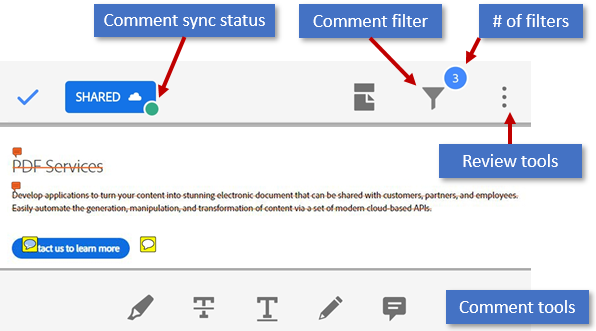

### Working with comments {#working-with-comments}

When you tap on a comment, the app shows the edit tools. From here you can: 

* Open the complete comment list. 
* Resolve comments (mark as read). 
* Edit the color of your own annotations. 
* Delete your own comments.
* Edit your own comments. 
* Navigate through the comments. 
* Reply.  

   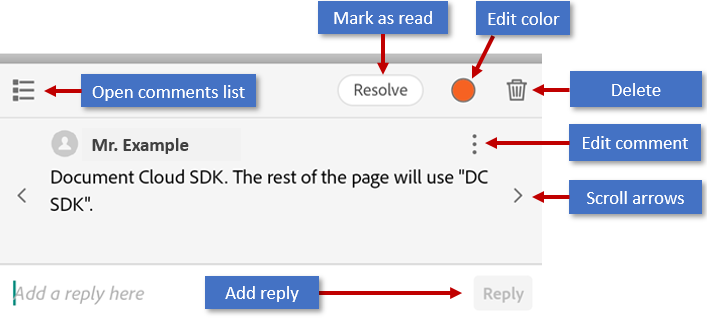

### Replying to a comment {#replying-to-a-comment}

From the comments list: 

1. Tap the comment. 
1. Enter text. 
1. Tap **Reply**.

   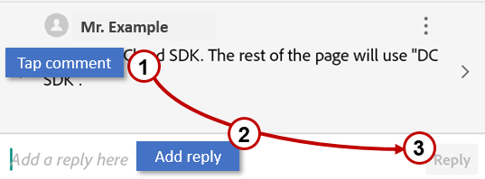

### Mentioning a specific reviewer {#mentioning-a-specific-reviewer}

In addition to replying to someone's comment, you can use the **@mention** tag to refer to them directly. Doing so sends the named user a notification that they have been specifically mentioned.

To use the tag: 

1. Create a new comment or reply to a comment. 
1. Tap  to display a list of reviewer names. 
1. Tap of one of the reviewer names.
1. Finish your comment and tap **Reply**. 

   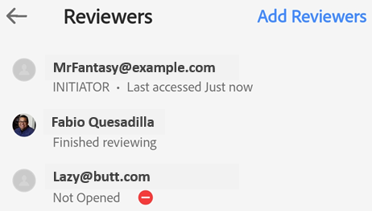

### Edit and delete comments {#edit-and-delete-comments}

You can remove your own comments and replies: 

1. Tap the comment. 
1. Tap 
1. Tap **Edit** or **Delete**. 

### Reviewing offline {#reviewing-offline}

You can review files even when offline. The app saves your comments and syncs them to the document once you have a connection. 

## Finding and navigating comments {#finding-and-navigating-comments}

### Viewing the comments list {#viewing-the-comments-list}

To display comments, tap  **> Comments List**.

### Filtering comments {#filtering-comments}

The app provides a number of ways to filter comments so that you can easily find what you need. You can filter by timeframe, reviewers, and whether or not the comment is read or resolved. 

1. Tap 
1. Tap any filter. 
1. Tap **Apply**.

   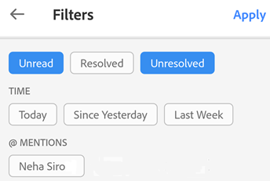

### Clearing filters {#clearing-filters}

One you've applied a comment filter, a filter bar appears at the bottom of the document diplays the number of selected filters and a **Clear** button. Tap **Clear** to remove all filters.

   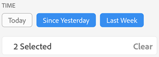

### Navigating through comments {#navigating-through-comments}

When documents contain a large number of comments, use the navigation tools: 

* Open the comments list and scroll through the comments list.
* From a specific comment, scroll left and right through the comments.

   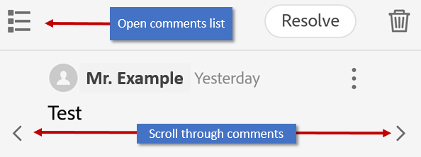

### Viewing notifications {#viewing-notifications}

The desktop, mobile, and web platforms provide a rich notification service which alerts you to file changes, messages from reviewers, and other items. Simply tap  to view the latest notifications. 

There are two types of notifications: Requests and simple messages. Requests are like action items--these may be direct messages, requests to reivew a file, and so on. 

   >[!NOTE]
   >
   > Notifications  include deadlines, reminders, real-time messages from the sender, and other messages.  Depending on what you've permitted, notifications may also appear on your device's home screen. 
 
   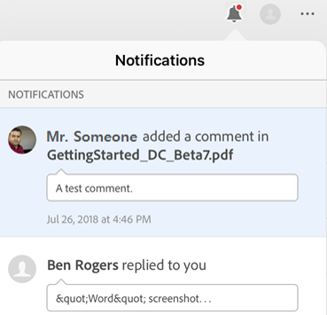

## Managing reviews {#managing-reviews}

While you will receive a notification when reviewers view and comment on your file, you can actively monitor and track reviews online or from the desktop. 

Once you've shared a file, you can track and manage that share. From any file list, select a file and use the right-hand pane to perform an action. 

Features include: 

* Send reviewers a real-time message. Messages are received as notifications
* View the reviewer list and how many comments each reviewer has added
* See who has viewed the file and when
* Add reviewers
* Unshare files and delete reviews

To manage a review when a document is open, simply click the . 

   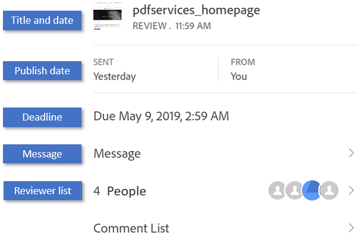

   >[!NOTE]
   >
   > The app provides similar functionality for shared files (view-only files not in a review).

### Viewing review status {#viewing-review-status}

When a review file is open, the top bar displays an overview of the review's current status. It indicates: 

* Document sync status. Changed files are automatically synced with Document Cloud. Files that have been saved display a green circle.
* Document title (tablets only)
 
   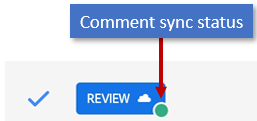

### Setting review deadlines {#setting-review-deadlines}

You can specify a deadline when setting up a review so that the review automatically ends.

1. Tap  and then tap **Set Deadline**. 
2. Set the calendar widget. 
3. Tap **OK**. 

   >[!NOTE]
   >
   > Notifications are sent to all recipients on the deadline date. 

   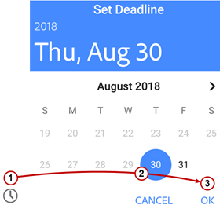

### Setting review reminders {#setting-review-reminders}

You can specify a reminders so that both you and the review recipients receive reminders that the review is active. 

1. Tap **Set Reminder**
1. Set the calendar widget. 
1. Tap **OK**. 

### Adding reviewers {#adding-reviewers}

The review initiator can add reviewers to an open share/review at any time. 

From any file list (Home, Shared, or search result): 

1. Tap 
1. Tap **Participants**. 
1. Tap **Add People**.
1. Enter an email address and tap **Send**. 

   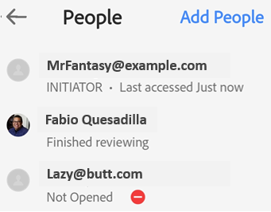

### Checking who has viewed a file {#checking-who-has-viewed-a-file}

Document recipients who have not yet opened a file appear in the recipient list with  next to their name. 

From any file list (Home, Shared, or search result): 

1. Tap 
1. Tap **Recipients**. 

   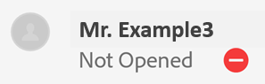

### Viewing the review message {#viewing-the-review-message}

If you need to review the initial message you sent when you share the file, from any file list (Home, Shared, or search result): 

1. Tap 
2. Tap **Message**. 

   

### Get a new file link {#get-a-new-file-link}

From any file list (Home, Shared, or search result): 

1. Tap 
1. Tap **Copy Link**. 

The link is copied to your clipboard.

### Unshare a file {#unshare-a-file}

From any file list (Home, Shared, or search result): 

1. Tap 
1. Tap **Unshare File**. 
1. Tap **Unshare** again to confirm. 

Unsharing a file prevents future access to that file for all users.

### Delete a share or review {#delete-a-share-or-review}

   >[!NOTE]
   >
   > I only see Unshare. Don't see **Delete**.

Only review initiators can delete their review. From any file list (Home, Shared, or search result): 

1. Tap 
1. Tap **Delete**. 
1. Tap **Delete** again to confirm. 

   >[!NOTE]
   >
   > Removing share and review privileges does not delete the file.

### Reporting abuse {#reporting-abuse}

Reviewers can report abuse when another reviewer violates Adobe's terms of use: 

1. Tap 
1. Tap **Report Abuse**. 
1. Tap **Continue** and complete the workflow.

   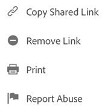

### Removing yourself from a review {#removing-yourself-from-a-review}

Removing your link to a review removes you as a reviewer. 

1. Tap  
1. Tap **Remove Me**. 
1. Tap **Remove Me** to confirm you'd like to remove yourself from the review. 

