# Settings {#settings}

## Device settings {#device-settings}

The app leverages your device's features, and its default settings make it easier and faster to work with your documents. by default, notifications are enabled. To streamline your ability to work with and share files, allow the app access to your camera, contacts, and storage. 

   >[!NOTE]
   >
   > Only notifications are enabled by default. For other access to other features, you will be prompted to grant permissions as needed. 

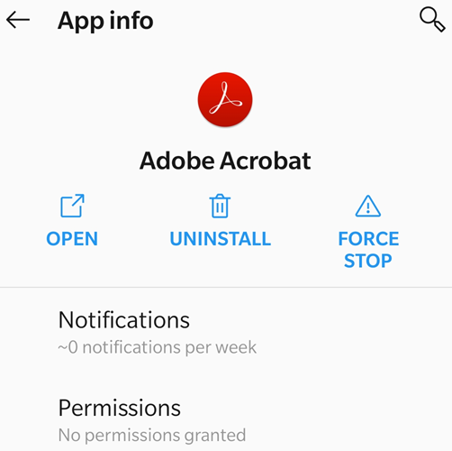

### General device permissions {#general-device-permissions}
 
To change a setting: 

1. Go to your device's settings screen. 
1. Tap **Apps > Adobe Acrobat**. 
1. Tap **Permissions** and set as needed. 

   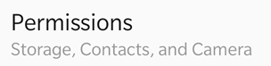

   >[!NOTE]
   >
   > The workflow and user interface may vary based on your OS version.

### Notifications {#notifications}

Notification behavior is controlled by your device (Android 8 and later). 

When enabled, notifications tell you when a file has changed, a reviewer has commented on a file, and so on, and they can appear both on your device as well as within Acrobat. When Acrobat detects unread notifications, the bell icon displays a red dot: . 

1. Go to your device's settings screen. 
1. Tap **Apps > Acrobat**. 
1. Tap **Notifications**. 
1. Set permissions as needed.

   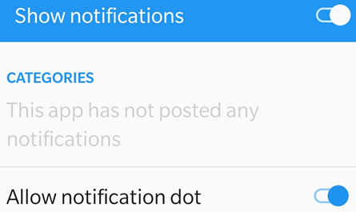

   >[!NOTE]
   >
   > From within the app, you can also tap  **> Preferences > Open Settings App** to open your device's settings.

### Dark (Night) mode {#dark-(night)-mode}

Use Dark Mode  (Night Mode on some devices) to improve reading in low light conditions, reduce eye strain, and can even extend your battery.

1. Go to your device's settings screen. 
1. Tap **Display > Night mode**. 
1. Configure the settings: enable night mode and set the color temperature and lightness. 

   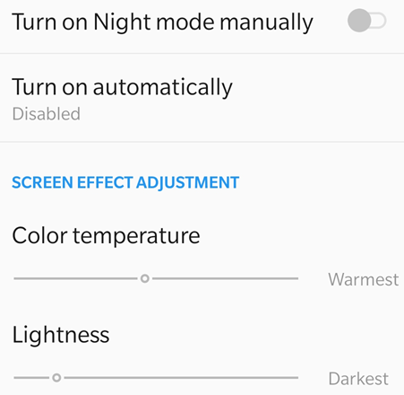

## Acrobat settings {#acrobat-settings}

Acrobat's settings allow you to pre-configure workflow features such as comment author name, form fill-in suggestions, and so on. To change these settings, tap  and navigate to the applicable screen as described below.

   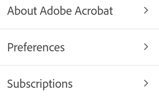

### Starred file location {#starred-file-location}

Starring a file is similar to "favoriting" a file: Once starred, a star appears next to the file in the locations you specify. 

1. Tap  > **Preferences**. 
1. In the Starred File Location box, tap the visible option. Choose one of the options from the dialog: 

    * **Document Cloud**: Automatically syncs starred files to the cloud. 
    * **This device only**: Stars the file on your device. 
    * **Ask every time**: When you star a file, a dialog asks whether you should be prompted every time to decide where to star the file.

1. Tap **OK**.

   

If you choose **Ask every time**, every time you star a file you'll be prompted decide whether to sync and star the file on Document Cloud or only on your device. If you tap **Remember this choice**, you device setting changes for all files you star in the future. 

   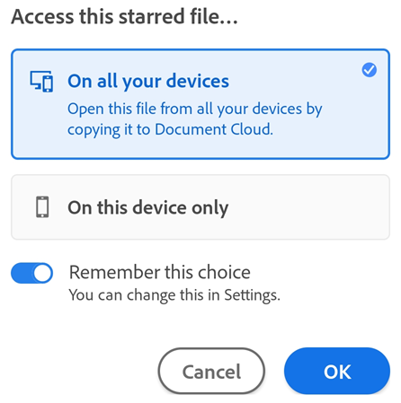

### Automatic form fill-in {#automatic-form-fill-in}

By default, the app uses your form fill-in history to automatically populate subsequent forms. This feature saves time, especially on a mobile device. Sources for suggestions include the following: 

* Data from saved forms: If the first two letters match data you've entered in past (and saved) forms, suggestions are populated from that usage history. 
* Date formats: Typing the first letter or any number in the current date suggests the following date formats: 8/06/2018; Aug 6, 2018; August 6, 2018.

To disable this feature:

1. Tap  > **Preferences**. 
1. Disable **Suggest previously used words when filling forms**.

   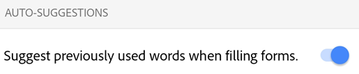

### Clearing form data history {#clearing-form-data-history}

You usage history is saved from completed forms. This allows the app to make suggestions as you type in form fields. To clear your suggestion history: 

1. Tap  > **Preferences**. 
1. Tap **Clear Suggestions > Remove**. 

### Setting the author name {#setting-the-author-name}

The review feature allows you to identify yourself as the author of comments and annotations. You can set your author name on-the-fly during a review or set it up ahead of time. 

To do so: 

1. Tap  > **Preferences**. 
1. Enter your name in the Author Name field. 
1. Tap **OK**.

   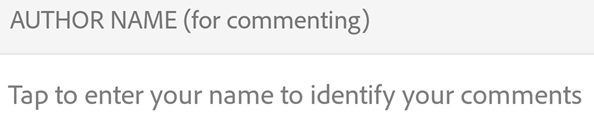

### Screen brightness lock {#screen-brightness-lock}

To prevent Acrobat from automatically dimming while you are reading:

1. Tap  > **Preferences**.
1. Enable Screen Brightness Lock.

   

### Setting the file cache {#setting-the-file-cache}

If you use Document Cloud for file storage, you can control where the files are cached. 

1. Tap  > **Preferences**.
1. Tap **Document Cloud Cache Location**.
1. chose one of the following: 

    * Internal storage: This option securely stores data on the device permanent memory. 
    * SD card: This option stores data on the SD card which all apps may be able to access and which can be removed the device. 

   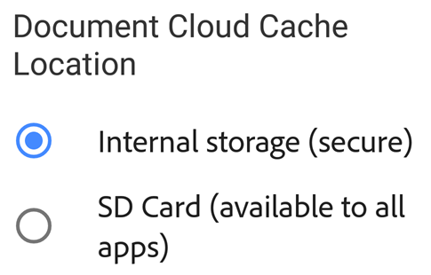

### Enrolling in Intune {#enrolling-in-intune}

With the August, 2019 release, Acrobat supports Microsoft Intune directly from the app. If you're organization uses Intune to manage devices and set preferences, you may be auto-enrolled your device. To check if you're enrolled:

1. Tap  > **Preferences**. 
1. Go to **Microsoft Intune**. 

If you're enrolled, **Enrolled** appears. 

### Viewing your subscriptions {#viewing-your-subscriptions}

If a feature you're trying to use is not available or asks you to subscribe, check your current subscriptions as follows: 

1. Tap 
1. Tap **Plans & Products** to see a list of current subscriptions.  
1. To add a subscription, tap **Subscribe** and complete the purchase workflow.

   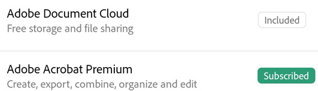

### Sending usage data to Adobe {#sending-usage-data-to-adobe}

By default, the app sends usage data to Adobe as part of the Product improvement program. Doing so helps the engineering team improve the product and provide you with a more personalized experience. To unenroll:

1. Tap  > **About Adobe Acrobat**. 
1. Disable **Send Usage Info**.

   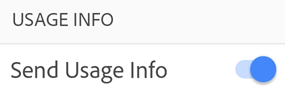

### App version {#app-version}

By default, the app automatically updates. To determine your installed product version, tap  > **About Adobe Acrobat**. 

The installed version appears under the **About** heading. 

   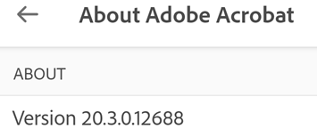
