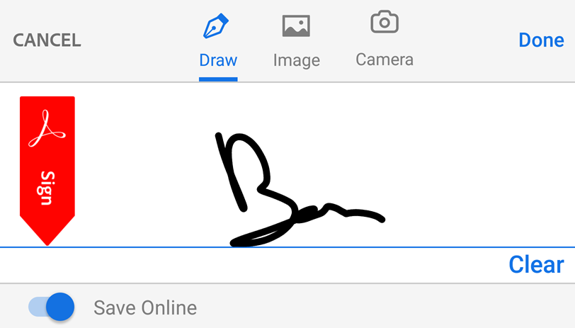
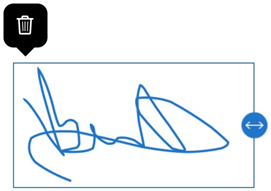
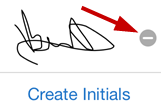
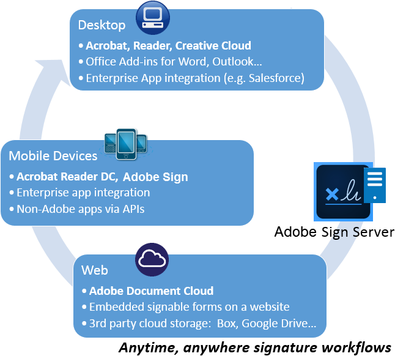

# Create signatures and sign {#create-signatures-and-sign}

Adobe's DC product family offers rich signing capabilities, including free features in Acrobat Reader, cloud-based eSign services that let you sign, send, and track documents from anywhere, and the Adobe Sign application that enables creating and managing signature workflows from your mobile device.

The following free features are available:

* Create a signature
* Sign
* Synchronize a signature across devices
* Resize or move a signature
* Remove your own signature  from a document
* Clear a saved signature
* Undo or redo the last action

## Create a signature {#create-a-signature}

You can create signatures or signing initials from a hand drawing, an image, or a camera picture:

1. Open any file that's not shared and is not security protected. 
1. Tap   > 
1. Tap 
1. Tap **Create Signature** or **Create Initials** and do one of the following:

    * Tap **Draw** to hand draw a signature.
    * Tap **Image**  to choose an image on your device.
    * Tap **Camera** to use your camera to capture an image of your signature.

1. Tap **Done**.

Note: Enable **Save Online** to store the signature on the cloud and synchronize it across all your devices.

   

## Sign a document {#sign-a-document}

1. Open any file that's not shared and is not security protected. 
1. Tap   > 
1. Tap 
1. Tap your stored signature or initials or create a new one. 
1. Tap the document move or resize the signatures.
1. Tap outside the signature to exit signing mode. 

## Synchronizing a signature across devices {#synchronizing-a-signature-across-devices}

Acrobat saves your signature and stores it in the cloud so you can use it on the desktop, the web, and all mobile apps, including Acrobat Reader, Adobe Scan, and Adobe Sign. All platforms support both photo, image, and hand drawn signatures.

When you create a signature, simply choose **Save Online** to store you signature in the cloud.

   

## Resize or move a signature {#resize-or-move-a-signature}

Before the document is closed, you can resize or move your signature. After the document is flattened, changes are not possible. To do so:

1. Tap a newly placed signature. 
1. Drag it to a new location or drag the resize arrows to change the size. 
1. Tap outside the signature to exit signing mode. 

   

## Remove a document signature {#remove-a-document-signature}

Signatures cannot be changed or removed after a document is saved. If you've signed a document and are still viewing it, delete the signature by tapping it and choosing 

   

## Clear a saved signature {#clear-a-saved-signature}

1. Open a signed file or file that's supported for signing. 
1. Tap   > 
1. Tap 
1. Tap 

   

## Undo or redo the last action {#undo-or-redo-the-last-action}

You can undo and redo your last action. Simply tap or .

## Manage signing workflows {#manage-signing-workflows}

Adobe Sign is a mobile companion to the Send for Signature tool and Adobe's enterprise-class e-sign services. It’s the ideal tool for initiating and managing signature workflows as well as collecting e-signatures in person from a client or customer. Adobe Sign is part of Adobe's signing ecosystem that allows you to sign, send, track, and manage signature workflows from the desktop, mobile devices, and the web.

   

## Frequently asked questions {#frequently-asked-questions}

**Why can't I sign a document?**

You cannot sign shared files, including shared for view-only and shared for review files. Also, secured documents restrict certain types of edits, including signing.

**Why can't I delete a signature in a document?**

Once a document is saved, the PDF is flattened and the signature cannot be removed.

**Why don't I see my comments, form data, or signatures in my PDF?**

It may be that you are not using Adobe's Acrobat Reader. Other PDF viewers may not support all the features that Adobe's Acrobat Reader supports. View your PDFs with Acrobat Reader, and if you send it to someone else, encourage the recipient to do the same.

**How can I display a list of signatures in a document?**

This feature is currently unsupported.

**Can I sign a password protected PDFs?**

No.