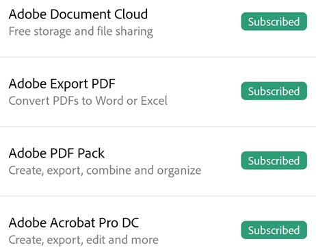

# Troubleshooting {#troubleshooting}

## Get help and find answers {#get-help-and-find-answers}

If you’re having trouble with the app, a particular file, or just have a question, get help from fellow users on the [online forum](https://www.adobe.com/go/acrobatmobilesupport).

## Determining your app version {#determining-your-app-version}

By default, the app automatically updates. To determine your installed product version, tap  > **About Adobe Acrobat**. 

The installed version appears under the **About** heading. 

## Determining who is logged in {#determining-who-is-logged-in}

The currently logged in user can be viewed by tapping 

## Finding your operating system version {#finding-your-operating-system-version}

Note: The method for finding the Android version varies across devices, but start by choosing **Settings > About Phone**.

1. Tap the device's Settings icon.
1. Tap **About phone** and look up your software version.

## Viewing your subscriptions {#viewing-your-subscriptions}

If a feature you're trying to use is not available or asks you to subscribe, check your current subscriptions as follows: 

1. Tap 
1. Tap **Plans & Products**.
1. To add a subscription, tap **Subscribe**.
1. Tap **Done**.

   

## Getting crash logs {#getting-crash-logs}

If your app crashes, perform the following steps to send us the crash logs:

1. Go to your device's settings 
1. Tap **About Phone > Build Number**. 
1. Tap on the build number 6 times to enable the developer options.
1. Tap the back button. 
1. Tap **Developer options > Take bug report**.
1. Tap  **Interactive report > Report**
1. When the bug report is ready, send the logs, device type, and OS version details to the [online forum](https://www.adobe.com/go/acrobatmobilesupport).

## Sending crash logs to Adobe {#sending-crash-logs-to-adobe}

If your app crashes, a dialog appears asking that allows you to choose whether to send the log always or just once. Choose **Always** to help Adobe resolve any app issues. 

## Send feature requests {#send-feature-requests}

Have a feature request or want to share ideas with the development team? [Click here](https://www.adobe.com/go/appstoresupportandroid).

## FAQs {#faqs}

**Why did my menus change or disappear?**

When a file is open, a single tap changes the view to immersive mode. Immersive mode hides the menus so that you can see more of the document. 

The menu varies based on the  viewing context. For example, items in the top menu bar change depending on whether you're viewing a private file, a shared file, or a review file.

**How do I force stop Acrobat Reader?**

It is sometimes useful to stop the application to clear the memory, reset the cache, etc. To do so, do one of the following:

* Tap your device's Recent Apps button, and swipe the app away.
* Go to **Settings > Application manager > Adobe Acrobat > Force Stop**.

