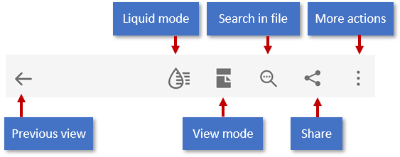
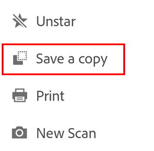
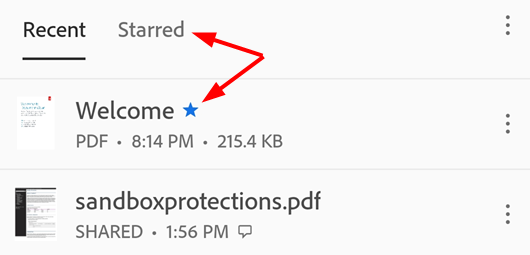
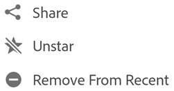
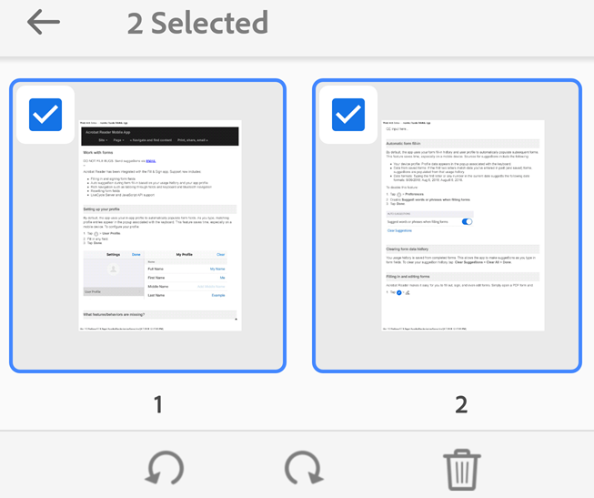
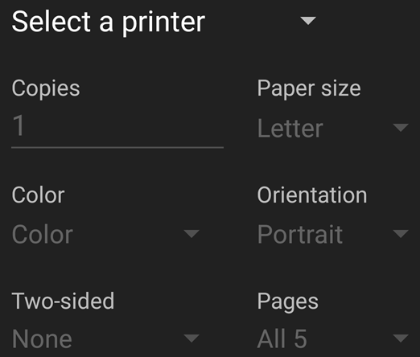
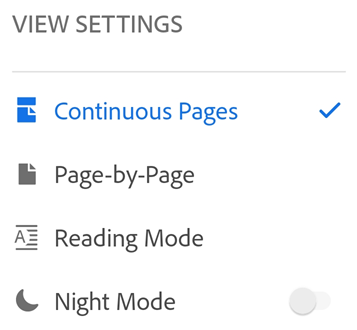

# Working with PDF {#working-with-pdf}

When you open a PDF, what menus appear will vary based on the file. Regular files (for example, those  not part of a review) display an action menu at the top and floating action bottom at the bottom. Both the overflow icon ( and floating action button |editicon.png) open a context menu displaying additional options based on your service subscriptions (For example, both Organize Pages and Create PDF require a subscription). 

## Menus and viewing contexts {#menus-and-viewing-contexts}

The user interface's menu options vary based on the viewing context. The top menu bar, context menu options, and the floating action button change based on the nature of the currently displayed file: 

* **Regular files** (not shared or in review): The top menu contains tools for changing the scroll mode, undo/redo, text search, share, and an overflow menu that provide access to tools for viewing comments, viewing bookmarks, printing, and actions associated with your subscription services. A floating action button () provides access to the tools Comments, Fill & Sign, and other subscribed services. 
* **Shared files** (view only): An overflow menu provide access to tools for printing and managing the shared file. 
* **Review files**: Files in an ongoing review display the comment bar, the comment filter, and an overflow menu that provide access to tools for managing the review. The floating action button is not available. For details, see [review](review.html).

## Sharing and commenting {#sharing-and-commenting}

See :ref:`share`. 

## Saving files {#saving-files}

### Save to Document Cloud {#save-to-document-cloud}

Some files are automatically saved to the cloud, including: 

* Any file that changes after downloading from the cloud. 
* Any file that requires Document Cloud features, including share, reviews, combining files, exporting PDF, and so on.

Note that actions which require choosing **Done**, **Save**, and so on are saved to their original location. 

### Saving local files to Document Cloud {#saving-local-files-to-document-cloud}

You can save files stored on your device to the cloud: 

From an unopened file: 

1. Go to the Home file list or **Files > On This Device**. 
1. Tap  and then tap 

From an opened file: 

1. Tap  and then tap 

### Save a file copy {#save-a-file-copy}

You can save files to any 3rd party connected storage Acrobat supports--not just Document Cloud, including shared and review files along with their comments. 

1. Tap  for any file. 
1. Tap **Save a Copy**
1. Select a location. 
1. Tap **Save**. 

   

## Starring files (favoriting) {#starring-files-(favoriting)}

Starring a file is similar to "favoriting" a file: Once starred, a star appears next to the file in the locations you specify. The star appears on all your devices, including your desktop. 

You can control the starred file location behavior with your :ref:`starsetting` settings. 
s
To star a file: 

1. Open the file. 
1. Open any context menu.
1. Tap . A star now appears next to the file in the locations specified by your :ref:`starsetting` settings. 

   

To unstar a file, open any context menu (usually by tapping  and tap |unstaricon.png).

   

## Organize pages {#organize-pages}

The Organize tool is a subscription service that supports rotating, reordering, and removing pages from files which have not been shared. Page level actions are blocked for shared and review files. To organize pages:

1. Log in to Document Cloud.
1. Open any file. 
1. Tap  and then tap 
1. Select one or more pages, and choose a tool.

   

   >[!NOTE]
   >
   > You can undo and redo any action by tapping  and then . 

### Rotate pages {#rotate-pages}

1. Log in to Document Cloud.
1. Open a non-shared PDF, and tap  and then tap 
1. Tap one or more pages. 
1. Tap  or |rotateright.png)

   

### Reorder pages {#reorder-pages}

1. Log in to Document Cloud.
1. Open a non-shared PDF, and tap  and then tap 
1. Long press any page. 
1. Drag the page to a new location. 

### Delete pages {#delete-pages}

1. Log in to Document Cloud.
1. Open a non-shared PDF, and tap  and then tap 
1. Tap one or more pages. 
1. Tap 

## Combine and compress files {#combine-and-compress-files}

See :ref:`combine`.

## Printing {#printing}

Printing uses your device's printing capabilities. You can set up a printer ahead of time or at the time of printing.

1. Open a PDF. 
1. Tap  and then  
1. In the Printer Options dialog, select a printer.
1. Set your printing preferences such as the number of copies, paper size, color, etc.
1. Tap **Print**.

   >[!NOTE]
   >
   > If no printer is found, you will be prompted to save the PDF to your device.

   

## View modes {#view-modes}

Enhance your PDF viewing experience with custom view mode settings.

### Scroll modes {#scroll-modes}

You can choose to have pages scroll continuously or show one page at a time:  

* Continuous Pages: Swipe up or down on the screen to change pages. Recommended when marking up documents.
* Page-by-Page: Swipe left or right to change pages, or tap the right or left document edge.

To set the view mode:

1. Tap anywhere in the PDF to show the tool bars if they are hidden.
1. Tap the view mode icon. The displayed icon represents the current view. 
1. Tap one of the view modes. 

   

   >[!NOTE]
   >
   > You can also keep the PDF screen from dimming by enabling your device's screen brightness lock.

### Reading mode {#reading-mode}

The text reflows to fit the current view. Note that in Reading Mode, objects recognized as images display on their own line with the  width limited to the screen width. Zoom is disabled, so parts of some images may appear off the screen.

The mode has a number of features which may enhance readability for some documents. Not all PDFs are compatible with Reading mode, and the feature is gradually phasing in over 2020 (and there not available to all users).

### Night mode {#night-mode}

Use Night Mode to invert black and white in low light conditions to reduce eye strain and extend your battery life.

### Two page with cover page (Tablets only) {#two-page-with-cover-page-(tablets-only)}

On devices with 7-8" screens and tablets, users can choose to show only the cover page on document open.

1. Tap anywhere in the PDF to open the menus if they are hidden.
1. Tap View mode menu icon.
1. Tap **Two Pages With Cover Page**.

### Hiding menus {#hiding-menus}

When a file is open, a single tap changes the view to immersive mode. Immersive mode hides the menus so that you can see more of the document. 

