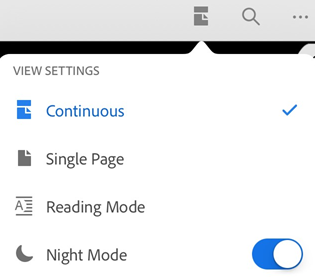
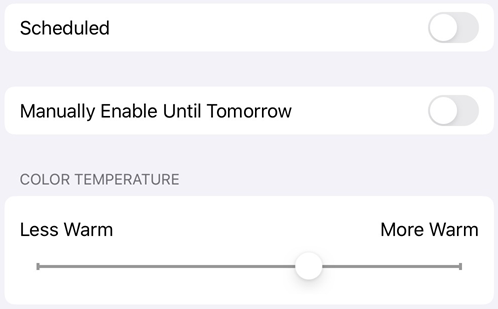
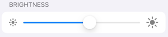
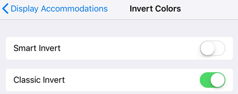
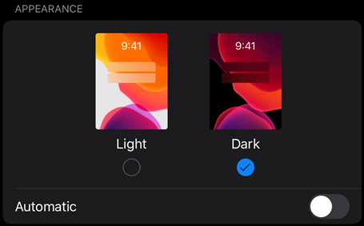
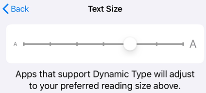
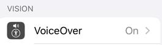

# Accessibility {#accessibility}

iOS devices support a number of accessibility features not listed here. For more information, refer to the [Apple support site](https://support.apple.com/en-us/HT204390). You can also check your accessibility settings by going to your device's settings screen and tapping **Accessibility**.  

## Visual features {#visual-features}

### Night mode {#night-mode}

Acrobat's Night Mode inverts black and white in low light conditions and increases contrast. Night mode also reduces eye strain and extends your battery life:

1. Open a document.
1. Tap the view mode icon (varies depending on the current mode).
1. Enable Night Mode.

   

   >[!NOTE]
   >
   > You can also keep the PDF screen from dimming by enabling your device's screen brightness lock.

### Reading in low light {#reading-in-low-light}

You can use your device's night shift feature to improve readability in low light conditions. Doing so reduces eye strain and extends battery life. 

1. Go to your device's settings screen. 
1. Tap **Display and Brightness**. 
1. Tap **Night Shift**. 

   

1. Configure the settings. Depending on your OS version, you can schedule night shift mode, manually enable the feature, and control the overall hue.

   

### Display brightness {#display-brightness}

Set your display's brightness to enhance readability as needed. 

1. Go to your device's settings screen. 
1. Tap **Display and Brightness**. 
1. Set the brightness level. 

   

### Inverting colors {#inverting-colors}

On iOS 11 and later (see iOS 13 below), your device settings include an option to invert colors. 

1. Tap **Settings > General** (pre iOS 13).
1. Tap **Accessibility**.
1. Tap **Display Accommodations**.
1. Tap **Invert Colors**.
1. Choose one: 

    * **Smart Invert** inverts most colors but leaves images, media, and some apps in their original state.
    * **Classic Invert** inverts everything.

   

On iOS 13 and later: 

1. Tap **Settings** (iOS 13).
1. Tap **Accessibility**.
1. Tap **Display and Text Size**.
1. Enable features such as: 

    * **Smart Invert** inverts most colors but leaves images, media, and some apps in their original state.
    * **Classic Invert** inverts everything.

   >[!NOTE]
   >
   > You can also change the contrast, text size, and other display features from this screen. 

### Dark mode {#dark-mode}

For users of iOS 13+, the October, 2019 Acrobat release supports dark mode. Dark mode's high contrast display may improve readability in low light environments as well as extend battery life. For some users, dark mode is an important accessibility feature that maintains color meaning and preserves image representation better than the night mode feature.

1. Go to your device's settings screen. 
1. Tap **Display and Brightness**. 
1. Choose light or dark mode.
 
   

### Dynamic type {#dynamic-type}

The iOS Dynamic Type feature allows you to specify a preferred text size. Acrobat's support for Dynamic Type means that its user interface will automatically scale fonts according to your settings. To increase or decrease Acrobat's font size: 

1. Go to your device's settings screen. 
1. Tap **Display and Brightness > Text Size**.
1. Adjust the slider to your preferred setting.  

   

## Audio features {#audio-features}

### Voiceover {#voiceover}

The app supports VoiceOver, the iOS built-in screen reader. VoiceOver allows someone with a visual impairment to use simple gestures to hear PDF content. With the October, 2019 release, VoiceOver support extends to Acrobat's Continuous reading mode. To enable VoiceOver: 

1. Go to your device's settings screen. 
1. Tap **Accessibility**. 
1. Tap **VoiceOver**, and enable the feature.  

   

## Gesture features {#gesture-features}

The app supports the standard VoiceOver gestures as described in [Apple's documentation](https://support.apple.com/guide/iphone/learn-voiceover-gestures-iph3e2e2281/ios).

There are also custom actions that help you access files. To display a context board for any file in a file list (Home, Files, Shared, and Search): 

1. Swipe down with one-finger on a file.
1. When you hear "Context Board", double-tap.

## Keyboard shortcuts {#keyboard-shortcuts}

If your device has a keyboard, Acrobat supports the following shortcuts: 

| Shortcut | Function |
| --- | --- |
| ⌘+ up arrow | Navigation Home (first page of the document) |
| ⌘ + down arrow | Navigation End (last page of the document) |
| ⌥ + up arrow | Scroll up / previous page |
| ⌥ + down arrow | Scroll down / next page |
| Shift + spacebar | Scroll up / previous page |
| Spacebar | Scroll down / next page |
| PageUp | Scroll up / previous page |
| PageDown | Scroll down / next page |
| Up arrow | Pan up |
| Down Arrow | Pan down |
| Left Arrow | Pan left |
| Right Arrow | Pan right |
| ⌘ + + | Zoom in |
