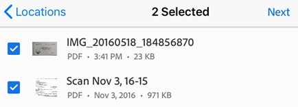
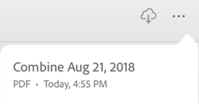
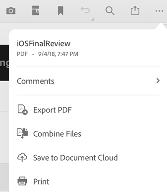

# Combine PDFs {#combine-pdfs}

Subscribers to Adobe Acrobat Premium or Adobe Acrobat Pro DC can combine any number of PDFs into a single PDF.

## Combining unopened files {#combining-unopened-files}

1. Log in to Document Cloud.
1. Go to any file list (Home, Files, Shared) and open a file.
1. Tap  and then tap 
1. Tap any file location, and navigate to a file.
1. Select any number of files. 
1. Tap **Next**. 

   

1. *Optional*: 

    * Reorder files by long pressing  and dragging it to a new location. You can also delete files from the combine list.
    * Tap  to rename the combined file.

1. Tap **Combine**.

The file is automatically sent to Adobe's Convert service and uploaded to Document Cloud. By default, the name is "Combine + (current date)". To rename the file, tap  > **Rename**. 

   

## Combining from an open file {#combining-from-an-open-file}

You can invoke the combine workflow from any file list. 

1. In any open file, tap  
1. Tap , and complete the workflow described above. 

   

