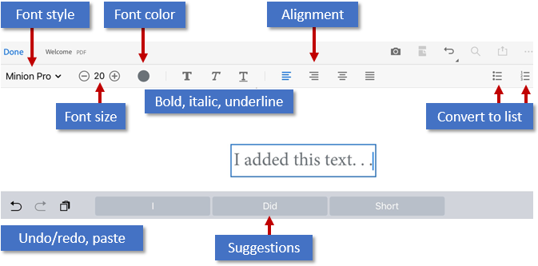
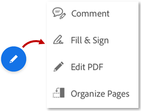
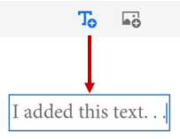
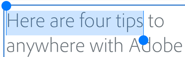
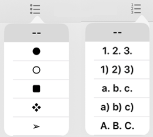
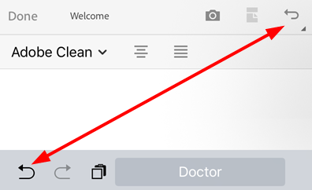

# Edit PDF {#edit-pdf}

Subscribers to Adobe Acrobat Premium or Adobe Acrobat Pro DC can edit PDFs on phones and tablets. The edit feature allows you to: 

* Add text and images
* Delete, move, and resize text blocks as well as edit text
* Change the font style, size, weight, color, and alignment
* Convert text to a bulleted or numbered list
* Delete, move, rotate, and resize images
* Undo and redo actions

## Open edit mode {#open-edit-mode}

To enter edit mode, tap  **> Edit PDF**. 

* To edit text or an image, simply tap it. 
* Tap  or  to add a text box or image. 

### Adding text {#adding-text}

Add new text as follows: 

1. Tap  **> Edit PDF**. 
1. Tap 
1. Tap the text location in the document.
1. *Optional*. Long press the text box to: 

    * Drag it to a different location. 
    * Grab a blue corner handle and resize the text box. 
    * Delete the text. Tap **Delete**. 
 
1. Select any text tool in the top menu. You can change the font style, size, weight, color, and alignment. 
1. Tap **Done**. 

   

### Editing existing text {#editing-existing-text}

To edit existing text: 

1. Tap  **> Edit PDF**. 
1. Tap a text block: 

    * Tap once and then tap **Select All** to select an entire text block. 
    * Tap once and then double tap inside a text block to show the text selection handles. Drag the handles to select specific text. 
 
1. Select any text tool in the top menu. You can change the font style, size, weight, color, and alignment. 
1. Tap **Done**. 

   

### Inserting lists {#inserting-lists}

You can insert a new list or convert existing text into either a bulleted or numbered list. To do so, simply select text as described above and tap one of the list icons. 

   

### Editing images {#editing-images}

You can delete, resize, rotate and move new and existing images: 

1. Tap  **> Edit PDF**. 
1. Tap an image. 
1. Long press an image and: 

    * Drag it to a different location. 
    * Grab a blue corner handle and resize the image. 
    * Delete the image. Tap **Delete**. 
    * Tap  or  to rotate the image.

1. Tap **Done**. 
 
   

### Adding images {#adding-images}

You can place a new image anywhere in a PDF: 

1. Tap  **> Edit PDF**. 
1. Tap 
1. Tap the image location in the document.
1. Tap an image source and navigate to the image. 
1. *Optional*. Long press the image to: 

    * Drag it to a different location. 
    * Grab a blue corner handle and resize the image. 
    * Delete the image. Tap **Delete**. 

1. Tap **Done**. 

   

### Undo-redo {#undo-redo}

You can always undo and redo actions. Available methods vary by context: 

* In edit mode, tap  or  in the upper right. 
* When the keyboard is open,  or . 

   

