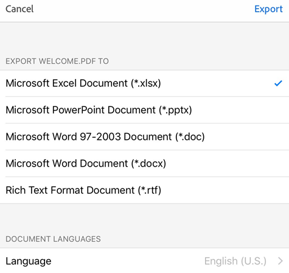
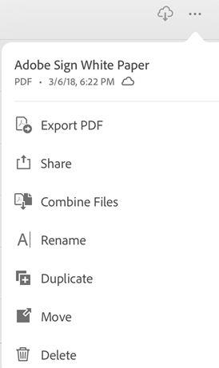

# Export PDF to other formats {#export-pdf-to-other-formats}

Subscribers to Adobe Export PDF, Adobe PDF Pack, or Adobe Acrobat Pro DC can export PDF content to other formats, including Word, Excel, PowerPoint, and rich text. During the export workflow, users also have the option of converting scanned text into actual text via optical character recognition. Many export languages are supported.

## Exporting an open PDF {#exporting-an-open-pdf}

To export an open PDF:

1. Log in to Document Cloud, and open a PDF.
1. Tap 
1. Tap 

   

1. Specify an export format, such as .docx, .rtf, etc. 
1. *Optional*: By default, the export language is the same as your installed app. You can change the language by tapping **Language** and selecting a different language.
1. Tap **Export**.

   

## Exporting an unopened PDF {#exporting-an-unopened-pdf}

You can invoke the export workflow from any file list. 

1. Go to any file list (Home, Files, Shared).
1. Tap  next to any file. 
1. Tap , and complete the workflow described above. 

   
