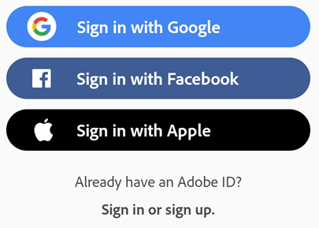
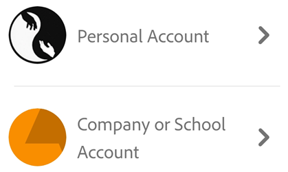
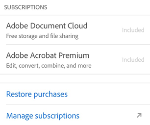

# Getting Started {#getting-started}

Acrobat Reader DC delivers one-click integration with  Adobe Scan and as well as enterprise-class PDF workflow features. Enterprise configuration options support managing your work and personal files as needed. An intuitive user interface works similarly across phones, desktop, and the browser. Now you can start a collaborative review at work, check review status and comment PDFs on the train, and access any PDF workflow on the web. 

*Enterprise administrators* Configure and deploy mobile apps so that end users can keep work and personal files separate. Configure access to Adobe Document Cloud as well as  3rd party cloud storage solutions and manage rich settings for both MAM and MDM environments. 

Whether you're at work or on the go, your files are simply accessible whenever you need them: 

* **Mobile**: Manage work and personal files from any location on your phone or tablet. 
* **Web**: Access files on Adobe Document Cloud, Google Drive, Dropbox, or any other location accessible on your device. 
* **Desktop**: Sign in to desktop Acrobat to see all your latest files. 

## Signing in {#signing-in}

Signing in is required for features using services, but it also provides many other  advantages: 

* Access to free features that leverage online services
* Access to advanced features which are part of your subscription services
* Enablement of the notification service which alerts you to file changes, workflow updates, review participation, etc. 
* Automatic saving of most file changes in Document Cloud which not only protects your work, but allows file access on any device
* Automatic sign in to both Acrobat and Adobe Scan

You can sign in to Document Cloud with an Adobe, Google/Facebook/Apple IDs, or a supported enterprise credential. 

1. Open the app. 
1. Choose a sign in option: 

* Tap a 3rd party sign in option: Facebook, Google, or Apple.
* Tap **Sign In** to use your Adobe ID, then enter your email address and password.
* Tap **Sign Up** to create a new Adobe ID.
 
   

### Signing in with a company or school ID {#signing-in-with-a-company-or-school-id}

You likely have a single login credential and will only see one set of screens. However, if you are part of an organization and have another ID, you may be prompted to choose between an personal or company ID. If so, select an account and log in with the credential associated with that account. 

   

### Signing out {#signing-out}

Signing out disables access to subscription services as well as online documents and workflows. 

To sign out, tap  **> Sign Out**.

## Manage DC subscriptions {#manage-dc-subscriptions}

Adobe's free Acrobat DC mobile apps allow you to easily share files across your mobile devices, desktop, and the cloud, initiate and participate in reviews, share files, scan, sign, and so on. Additional features are available as subscription services, including creating PDFs, exporting PDFs to other formats, and editing PDFs.

### Subscribing to services {#subscribing-to-services}

To view your subscriptions and add new ones:

If a feature you're trying to use is not available or asks you to subscribe, check your current subscriptions as follows: 

1. Tap 
1. Tap **Subscriptions**.
1. To add a subscription or find out more details, tap **Subscribe**.

### Upgrading existing subscriptions {#upgrading-existing-subscriptions}

The subscription workflow does not block you from upgrading to a package that includes services to which you are already subscribed, but it does tell you to cancel those existing subscriptions. For example, if you subscribe to Acrobat Pro DC, you should cancel all other subscriptions.

### Managing DC subscriptions {#managing-dc-subscriptions}

You can manage your subscriptions from any device: 

1. Tap 
1. Tap **Manage subscriptions**.

You can manage your subscriptions from any device in the App Store, or you can use iTunes on your computer. For details, see https://support.apple.com/en-us/HT202039.

   

### Canceling a subscription {#canceling-a-subscription}

To cancel a subscription purchased outside of the Apple Store, follow the [online instructions](https://helpx.adobe.com/x-productkb/policy-pricing/cancel-subscription-acrobat-online-services.html).

### Refund policy {#refund-policy}

**Apple App Store**: Adobe does not issue refunds for purchases made directly through the Apple App Store. Any refund or billing requests are handled by their support team: https://support.apple.com/en-us/HT204084 

.. toctree::
    :maxdepth: 2
    :hidden:

    settings
    workingwithpdf
    lmode
    navigatesearch
    openfiles
    managefilesfolders
    review
    signing
    forms
    createpdf
    exportpdf
    combine
    editpdf
    protect
    accessibility
    troubleshooting
    whatsnew