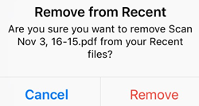
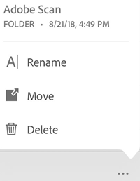

 
# Managing files and folders {#managing-files-and-folders}

## Opening files in Acrobat {#opening-files-in-acrobat}

Becasue Acrobat integrates with any Adobe DC app, other cloud storage solutions, other apps, and OS features such as the Files app, it's easy to open PDFs in Acrobat from nearly any location. See :ref:`openfiles` for details about opening files from:

* Dropbox
* Email
* iOS Files app
* Browsers
* iBooks

## File management {#file-management}

### Rename files {#rename-files}

Rename files from any file list, including Home, Files, and any file in a search result: 

1. Tap 
1. Tap  
1. Enter a name. 
1. Tap **Rename**.

### Duplicate files {#duplicate-files}

From any file list, including Home, Files, and a list of search results: 

1. Tap 
1. Tap 

The file is automatically duplicated with the same name and a **(1)**. You can rename the file as you would any other file. 

### Move files {#move-files}

Acrobat only supports moving Document Cloud files. From a file list, including Files and a list of search results: 

1. Tap 
1. Tap  
1. Tap a new location. 
1. Tap **Move**. 

### Deleting files {#deleting-files}

From any file list, including Home, Files, and a list of search results: 

1. Tap 
1. Tap 
1. Tap **Delete** to confirm the action.

### Remove from Recent list {#remove-from-recent-list}

The Home view shows your most recently viewed files in chronological order. To remove files from the Recent file list:

1. Tap 
1. Tap  
1. Tap **Remove** to confirm the action.

   

### Saving files to the cloud {#saving-files-to-the-cloud}

Cloud-based files are automatically saved to the cloud after you make a change. Local files can be manually uploaded.

To save a local file to the cloud: 

1. Go to your Files list. 
1. Tap **Locations > On This iPad**. 
1. Tap 
1. Tap 

## Folder management {#folder-management}

Acrobat supports folder management for local files, Document Cloud, and Dropbox. 

From the **Files > Document Cloud** view, tap  to the right of any folder to rename or delete it. 

   

### Rename folders {#rename-folders}

From the **Files > Document Cloud** view:
 
1. Tap 
1. Tap 
1. Enter a name. 
1. Tap **Rename**.

### Delete folders {#delete-folders}

From the **Files > Document Cloud** view: 

1. Tap 
1. Tap 
1. Tap **Delete** to confirm the action.

### Create a new folder {#create-a-new-folder}

From the **Files > Document Cloud** view:

1. Tap 
1. Tap 
1. Enter a folder name. 
1. Tap **Create**. 