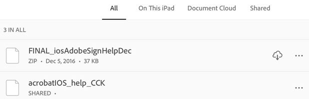
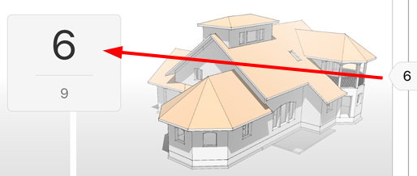
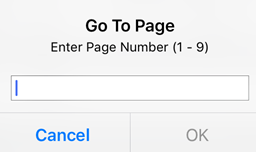
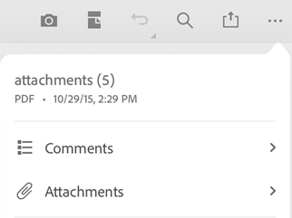

# Navigate, find, search {#navigate,-find,-search}

## Finding files {#finding-files}

Acrobat Reader provides a number of ways to help you find files, file content, and folders. When no file is open, the bottom menu displays locations for the following:

* **Home**: When you start Acrobat, the Home screen shows you all of your files regardless of location. Recently viewed files appear at the top of the list. 
* **Files**: The Files list allows you to select local or cloud location.
* **Shared**: When you're signed in, the shared file list displays files you've shared as view-only or sent for review. 
* **Search**: Searching returns a list of all the files that match your search parameters.

### Recent files {#recent-files}

To see a list of recently viewed files, tap **Home**. 

### Searching for files {#searching-for-files}

Search for a file by title as follows: 

1. With no file open, tap .
1. Enter the search term.
1. Tap the keyboard arrow. 

 When the search result appears, you further refine the result by tapping on a file location.

   

## Navigating and finding content {#navigating-and-finding-content}

### Searching within a file {#searching-within-a-file}

1. Open a file. 
1. Tap 
1. Enter the search term.
1. Tap Search. The first result is highlighted.
1. Tap the right or left arrow to show the next or previous occurrence.

   

### Showing menus {#showing-menus}

By default, a menu at the top of an open file displays icons for common tasks. The menu varies based on the  viewing context. For example, items in the top menu bar change depending on whether you're viewing a private file, a shared file, or a review file. 

When a file is open, a single tap changes the view to immersive mode. Immersive mode hides the menus so that you can see more of the document. 

### Jumping multiple pages {#jumping-multiple-pages}

When your PDF document has five or more pages:

1. A scrubber tab appears (navigation slider). Depending on your view mode, it will appear on the right side or bottom of the of the screen.
1. Long press the tab and slide to another page. 

   

### Go to page {#go-to-page}

When your PDF document has 5 or more pages:

1. Tap the scrubber tab. Depending on your view mode, it will appear on the right side or bottom of the of the screen.
1. Enter a number in the Go To Page dialog. 
1. Tap **OK**.
  
   

### Smart zoom {#smart-zoom}

Double-tap anywhere in your document to zoom into the exact content you want to see. Acrobat Reader analyzes the document and fits the view to the column of text under your tap. Double tap again to zoom out.

   

### Viewing the navigation menu {#viewing-the-navigation-menu}

In a PDF, tap  to show the action menu with links to items in the document. If they exist, then the menu provides links to: 

* Comments
* Bookmarks
* Attachments

   

### Viewing comments {#viewing-comments}

Files in an open review may content a list of reviewer comments. To view the comments: 

1. Tap the PDF to show the menus.
1. In a PDF, tap 
1. Tap **Comments**.
1. Navigate through the comments, and tap the one you need to open the specified page.

### Viewing attachments {#viewing-attachments}

When a document has attachments, you can navigate to them quickly by using the pop up menus:

1. Tap  
1. Tap **Attachments**.
1. Tap an attachment to view it. If it's not a PDF, you'll be prompted to open it in a supported app. 
1. Tap **Back** to return to the main document.

### Viewing bookmarks {#viewing-bookmarks}

If a document contains bookmarks, an icon appears in the lower right toolbar.

1. Tap the PDF to show the menus.
1. In a PDF, tap 
1. Tap **Bookmarks**.
1. Navigate through the bookmarks, and tap the one you need to open the specified page.

