# Opening Files in Acrobat {#opening-files-in-acrobat}

For many users, PDFs arrive on their device via a browser, email, or some other non-Adobe app. It's easy to make these PDFs available in Acrobat, and you can quickly configure many apps and device features so that Acrobat is an integrated part of viewing, sharing, and reviewing workflows. 

You can open a PDF in Acrobat from any application, including:

* Apple's Files app
* Other Adobe apps such as  Adobe Scan and Adobe Sign
* Email and messaging apps
* Browsers
* Cloud storage services like Document Cloud and Dropbox

## "Copy to" vs "Open in" {#"copy-to"-vs-"open-in"}

To help you get your work done, Acrobat supports opening, sharing, and copying many document types to and from your device as well as other non-Adobe apps. Your file workflows may involve menu options for: 

* **Open in Acrobat**: The *open in* option is provided by your iOS) and results in  both Acrobat and the source app sharing a single file.  For example, when choosing "Open in" while sharing from the Files app, Acrobat uses a reference to the source file. The file is not copied to Acrobat. Any changes made to the file in Acrobat save those changes back to the original file. 

* **Copy to**: Alternatively, *copy to* copies the file to Acrobat’s local documents cache which only Acrobat may access.  Changes are saved to Acrobat's private copy and the original file remains unchanged. 

Note that workflows might use both the **Open In** and **Copy To** features since Acrobat makes copied files accessible to other apps. For example, you can "Copy To" a file from Mail into Acrobat and then use the Files app to "Open In" that same file into PDF Expert. Similarly, from PDF Expert you may choose **"Import From" > Choose files**, and browse to Acrobat to open a file. Changes made in these external apps are saved back to Acrobat.

## Why use Acrobat? {#why-use-acrobat?}

Adobe recommends viewing PDFs in Acrobat Reader because other viewers (for example, Apple's built-in PDF viewer and other PDF apps) do not display items such as sticky notes, highlight, freehand drawing, handwritten signatures, filled form data, etc. To use these cool features, simply copy the file to Acrobat. 

## Adding Acrobat to the Share menu {#adding-acrobat-to-the-share-menu}

The most common way to open files in Acrobat is to share PDFs (open it) from other apps via the Share menu (Tap ). Sharing a file with Acrobat simply copies the file to Acrobat, and it opens automatically.

Acrobat may not appear in the app share list by default. To add Acrobat as a default item in the share list: 

1. Open a PDF in any app.
1. Tap **Open In...** or the  (varies by app and OS version).
1. Swipe left until the **More** icon appears, and tap it. 
1. When the app list appears, tap **Edit**. 
1. Scroll down the app list and tap **Copy to Acrobat**. 
1. Tap **Done** to exit edit mode.
1. Tap **Done** again to exit the Share settings dialog. 

You should now see Acrobat as a share choice whenever you tap the Share icon from any app. 

   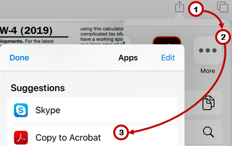

## Browsers: Safari, Chrome, etc. {#browsers:-safari,-chrome,-etc.}

While different browsers may have different workflows, the most popular browsers share a common method. In both Safari and Chrome, open an online PDF Acrobat as follows:

1. Tap the . 
1. Swipe left to show Acrobat.
1. Tap **Copy to Acrobat**.

   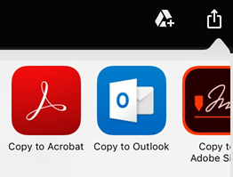

## Email {#email}

Email-to-Acrobat workflows vary across email apps; however, the two examples below describe a couple common scenarios. Note that some email apps experience known problems with many attachment types (not just PDF attachments).

### Apple Mail {#apple-mail}

1. In an email with a PDF attachment, scroll to the bottom. 
1. Tap **Tap to Download**. A PDF preview page appears. 
1. Tap on the  preview.
1. Tap the  in the lower left. 
1. Swipe left to show Acrobat.
1. Tap **Copy to Acrobat**.

### Gmail {#gmail}

1. In an email, tap the PDF attachment.
1. Tap the .
1. Tap **Copy to Acrobat**.

   

## Adobe Scan {#adobe-scan}

If you have Adobe Scan installed, you can open any scanned file directly in Acrobat and add comments, edit the file, and so on. 

1. From the Recent file list, tap  on any file. 
1. From All Scans, tap  on any file and then tap 

   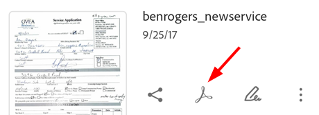

## Cloud storage {#cloud-storage}

By default, Acrobat Reader integrates Adobe Document Cloud. However, the app also supports opening files from any location available on your device.

   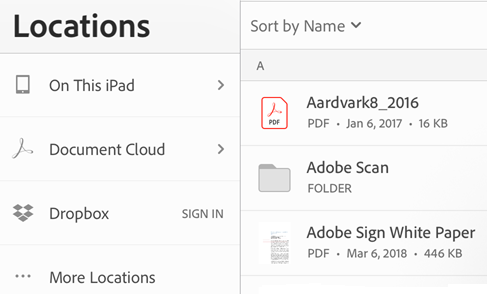

### Document Cloud {#document-cloud}

Integration with Document Cloud is automatic. 

1. Tap **Files** to show your file locations. 
1. Tap **Document Cloud** (tap **Sign In** if not signed in). 
 
### Dropbox {#dropbox}

If you have a Dropbox account, Acrobat can list and directly open your Dropbox files. You can also save files opened in Acrobat back to Dropbox. 

**Sign in**

1. Tap **Files** to show your file locations. 
1. Tap **Dropbox** (tap **Sign In** if not signed in). 
1. On first usage, Acrobat will prompt you to allow Dropbox access. Tap **Allow**. 

   

**Open files from Acrobat**

Once signed in, simply tap **Files > Dropbox** to see all of your files. Any files you edit or comment on are automatically saved back to Dropbox.

   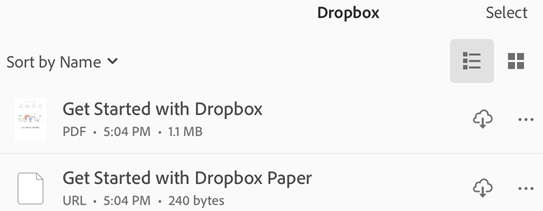

**Open files from Dropbox**

Once you connect Dropbox and Acrobat, you can open any file in Dropbox directly in Acrobat:

1. From your file list or from an open file, tap , and the tap 
1. Tap **Copy to Acrobat**. 

### Custom cloud locations {#custom-cloud-locations}

Acrobat uses the iOS File Browsing feature to help you find and connect to any of your file storage providers. **Note**: The instructions below may vary by device type and iOS version. 

To add a custom location: 

1. In Acrobat, tap **Files**
1. Tap **More Locations**. 

When the file browser opens, you can do any of the following: 

* *Browse to and open a specific file*: You can search for a file or tap **Recents** or **Browse**. 
* *View a list of locations*: Tap **Locations**. You may have the option to connect iCloud Drive from this screen. 
* *Edit your locations list*:  Tap **Locations > Edit** to change your location's list, or select a location and complete the connection workflow if required.  

   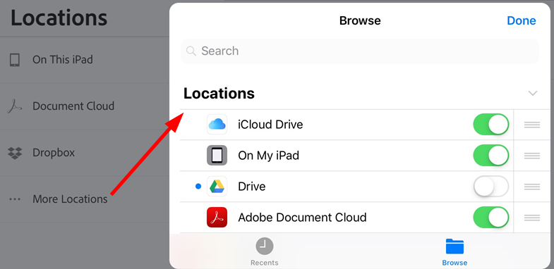

## Files app integration {#files-app-integration}

The iOS Files App (iOS 11+) allows you to easily find, organize, and manage all of your files. Available files include not only local files on your device, but also files on other iOS devices as well as cloud services such as Adobe Document Cloud. Adobe DC mobile app support for the Files app means you have greater control and ease of access for all your files and scans no matter where they reside. 

For additional details beyond what appears below, see https://support.apple.com/en-us/HT206481. 

### Open a file in Acrobat

1. Tap the Files App icon. You'll see all of your files, including any files in Adobe Acrobat or Adobe Scan. 

   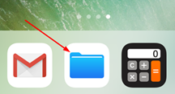

1. Browse to or search for a file. Open it. 
1. Tap  > **Open in Acrobat**. 

   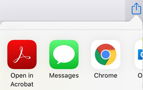

### Add Acrobat to the File App list {#add-acrobat-to-the-file-app-list}

If Acrobat is not already in the File App's list of available locations: 

1. Tap the Files App icon. 
1. Tap 
1. Tap **Edit**. 
1. Enable and disable locations as needed. You can also long press  and drag items to a new position. 
1. Tap **Done**.

   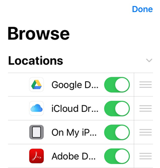

## Airdrop {#airdrop}

AirDrop enables you to wirelessly share files from one Apple device to another (iPhone to iPad to Mac).

   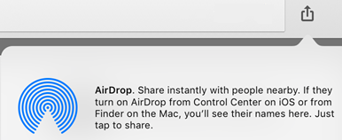

.. Note:: AirDrop requires that you set up the target and receiving devices as described in [Apple's instructions](https://support.apple.com/en-us/HT204144). Devices should be on, unlocked, AirDrop-enabled, wireless and Bluetooth should be on, and so on. By default, the receiving device limits shares to people in the contacts list. 

1. Open the PDF you'd like to share. 
1. Tap  > **AirDrop**.
1. Choose the receiving device. If you don't see the required device, it's likely not set up correctly. 
1. When the dialog appears on the target device saying "AirDrop Open with...", choose **Acrobat**.

   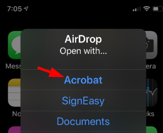

## iBooks {#ibooks}

iBooks does not offer an "Open In" or "Share" option. To transfer a PDF document from iBooks to Acrobat Reader, email the PDF document to yourself and open it from your email as described above.
