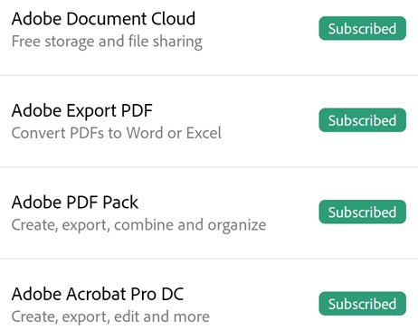

   
# Troubleshooting {#troubleshooting}

## Forum-community help {#forum-community-help}

Get help from fellow users on the [online forum](https://www.adobe.com/go/acrobatmobilesupport).

## File bugs and feature requests {#file-bugs-and-feature-requests}

You're always welcome to file bugs and feature requests or share ideas with the development team  [here](https://www.adobe.com/go/acrobatiosfeedback).

## Determining your application version {#determining-your-application-version}

By default, the app automatically updates. To determine your installed product version: 

1. From the Home page, tap 
1. In the settings pane, look under **About Adobe Acrobat**. 

## Determining who is logged in {#determining-who-is-logged-in}

The currently logged in user can be viewed by tapping  on the Home page.

## Finding your operating system version {#finding-your-operating-system-version}

1. Open your device's settings screen. 
1. Tap **General > About**. 

The *Version* field displays your software version.

## Viewing your subscriptions {#viewing-your-subscriptions}

If a feature you're trying to use is not available or asks you to subscribe, check your current subscriptions as follows: 

1. Tap 
1. Tap **Plans & Products**.
1. To add a subscription, tap **Learn More**.

By default, you should see your name as well as a list of current subscriptions.  

   

## Menus {#menus}

**Why did my menus change or disappear?**

When a file is open, a single tap changes the view to immersive mode. Immersive mode hides the menus so that you can see more of the document. 

The menu varies based on the  viewing context. For example, items in the top menu bar change depending on whether you're viewing a private file, a shared file, or a review file.