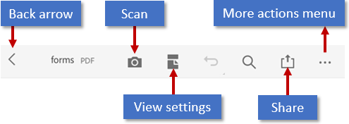
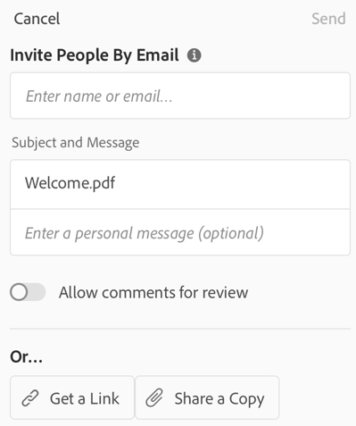
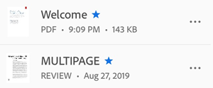
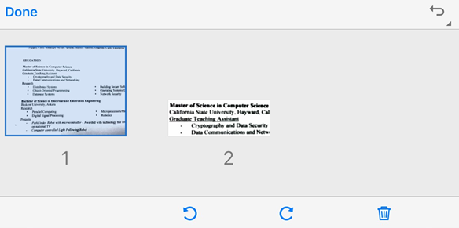
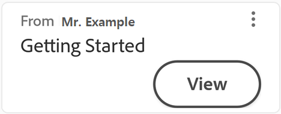
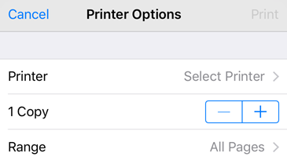

# Working with PDF {#working-with-pdf}

When you open a PDF, what menus appear will vary based on the file. Regular files (for example, those  not part of a review) display an action menu at the top of the screen and a floating action bottom at the bottom. 

Both the overflow icon () and floating action button  open a context menu displaying additional options based on your service subscriptions. For example, both Organize Pages and Edit PDF require a subscription. 

## Menus and viewing contexts {#menus-and-viewing-contexts}

Menu options vary based on the viewing context. The top menu bar, context menu options, and the floating action button change based on the nature of the currently displayed file: 

* Regular files (not shared or in review): The top menu contains tools for changing the view mode, undo/redo, text search, share, and an overflow menu that provide access to tools for viewing comments, viewing bookmarks, printing, and actions associated with your subscription services. A floating action button () provides access to the tools Comments, Fill & Sign, and other subscribed services. 
* Shared files (view only): An overflow menu provide access to tools for printing and managing the shared file. 
* Review files: Files in an ongoing review display the comment bar, the comment filter, and an overflow menu that provide access to tools for managing the review. The floating action button is not available. For details, see [review](review.md).

## Commenting {#commenting}

   >[!NOTE]
   >
   > For details about review workflows, see [Sharing Files and Starting Reviews](review.md)_. 

Acrobat's rich commenting features support sticky notes, highlight, crossout, underline, adding text, freehand draw, and adding text comments to any markup type. To comment a file: 

1. Open a PDF.
1. Tap 
1. Tap 
1. Tap a tool in the comment tool bar.

1. Place your markup in the document.

    * Sticky notes and Add Text: Tap a location, enter text, and then tap **Post**.
    * Markup (underlines, highlight, etc.): Long press a location and drag to select text. To add a note to the markup: tap it, enter text, and then tap **Post**.

You can also delete, edit, and reply to comments. 

## Sharing a PDF {#sharing-a-pdf}

Sharing files is as simple as tapping  and completing the share workflow. Sharing requires an internet connection.

1. Open a PDF. If the top menu is not visible, tap the document. 
1. Tap 
1. Add 1 or more email addresses.
1. Choose **View** or **Review**. View files are read-only. Review files allow recipients to add comments and annotations. 
1. Optional: Tap the subject line and message to edit them.
1. Choose **Create Link** or **Share a Copy**. 
1. Choose **Send**.

Your file is automatically uploaded to Document Cloud so that it's available on  any device.

   

   >[!NOTE]
   >
   > For details about sharing and review workflows, see [Sharing Files and Starting Reviews](review.md). 

## Saving files {#saving-files}

Some files are automatically saved to the cloud, including: 

* Any file that changes after downloading from the cloud
* Any file that requires Document Cloud features, including share, reviews, combining files, exporting PDF, and so on

Actions which require choosing **Done**, **Save**, and so on are saved when you exit that action. 

## Saving local files to the cloud {#saving-local-files-to-the-cloud}

You can save files stored on your device to the cloud: 

1. Go to the Home file list or **Files > On This Device**. 
1. Tap   and then tap 

## Starring files {#starring-files}

Starring a file helps you keep track of important files. Once starred, a star appears next to the file in the locations you specify. 

You can control the starred file location behavior with your :ref:`starsetting` settings. For example, you can star a file on the cloud but not on your device.s

To star a file: 

1. Open the file. 
1. Open any context menu.
1. Tap . A star now appears next to the file in the locations specified by your :ref:`starsetting` settings. 

   

To unstar a file, open any context menu (usually by tapping ) and tap 

## Sharing a link or file copy {#sharing-a-link-or-file-copy}

While you can't open a PDF in another app directly from Acrobat, you can share links and file copies. To do so, use the Share method described above. If you don't enter any email addresses prior to to choosing **Create Link** or **Share a Copy**, the app invokes your app list. You can then email the file, save a copy to Google Drive, or share the file with any supported app you've installed. 

## Editing {#editing}

iPad users with a subscription to the edit service can modify PDF files. See [Edit PDF](editpdf.md) for details about changing font styles, colors, size, alignment, and other features. 

## Organize pages {#organize-pages}

The Organize tool is a subscription service that supports rotating, reordering, and removing pages from files which have not been shared. Page level actions are blocked for shared and review files. To organize pages:

1. Log in to Document Cloud.
1. Open any file. 
1. Tap  and then tap 
1. Tap pages and choose a tool.

   

   >[!NOTE]
   >
   > You can undo and redo any action by tapping the icons in the upper right. 

### Rotate pages {#rotate-pages}

1. Log in to Document Cloud.
1. Open a non-shared PDF, and tap  and then tap 
1. Tap one or more pages. 
1. Tap  or 

   

### Reorder pages {#reorder-pages}

1. Log in to Document Cloud.
1. Open a non-shared PDF, and tap  and then tap 
1. Long press any page. 
1. Drag the page to a new location. 

### Delete pages {#delete-pages}

1. Log in to Document Cloud.
1. Open a non-shared PDF, and tap  and then tap 
1. Tap one or more pages. 
1. Tap 

## To Do cards {#to-do-cards}

**To Do** cards appear at the top of the Home screen whenever you receive a new review, share, or file to sign. Once you've completed the "To Do" action (viewed, signed, etc.), the  card is removed from the list. 

* Tap the card to open the file. 
* Tap  **> Report Abuse** to submit a report to Adobe. 
* Tap  **> Remove** to permanently remove the card.

   

## Printing {#printing}

Printing uses your device's printing capabilities. You can set up a printer ahead of time or at the time of printing.

1. Open a PDF. 
1. Tap  and then  
1. In the Printer Options dialog, select a printer.
1. Use the + and - buttons to set the number of copies to print.
1. Tap Print.

   >[!NOTE]
   >
   > Note that the printer must be AirDrop enabled. For more detail, see https://support.apple.com/en-us/HT201387.

   

## View settings {#view-settings}

Enhance your PDF viewing experience with custom view mode settings. To set the view mode:

1. Tap anywhere in the PDF to show the tool bars if they are hidden.
1. Tap the view mode icon. The displayed icon represents the current view. 
1. Tap one of the scroll modes and/or Night Mode: 

    * Continuous: Swipe up or down on the screen to change pages. Recommended when marking up documents.
    * Single Page: Swipe left or right to change pages, or tap the right or left document edge.
    * Reading Mode: The text reflows to fit the current view. Note that in Reading Mode, objects recognized as images are displayed on their own line with the displayed width limited to the screen width. Zoom is disabled, so parts of some images may appear off the screen.
    * Night Mode: Use Night Mode to invert black and white in low light conditions to reduce eye strain and extend your battery life.

   >[!NOTE]
   >
   > You can also keep the PDF screen from dimming by enabling your device's screen brightness lock.

   

### Using Liquid Mode {#using-liquid-mode}

See :ref:`lmode`.

## Hiding menus {#hiding-menus}

When a file is open, a single tap or scrolling up changes the view to immersive mode. Immersive mode hide the menus so that you can see more of the document. 
