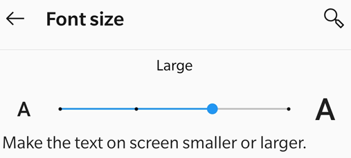
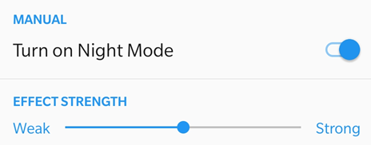
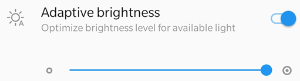
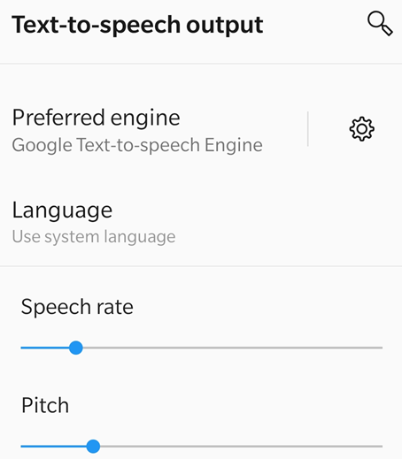

# Accessibility {#accessibility}

Android devices support a number of accessibility features not listed here. For more information, refer to the [Android Accessibility Overview](https://support.google.com/accessibility/android/answer/6006564?hl=en). You can also go check out your accessibility settings by going to your device's settings screen and tapping **Accessibility** (or search for it if the menu item does not display). 

## Visual features {#visual-features}

### Text display size {#text-display-size}

Android allows you to specify a preferred text size. The app's support for font sizes means that its user interface will automatically scale fonts according to your settings. To increase or decrease the app's font size: 

1. Go to your device's settings screen. 
1. Tap **Accessibility** (or search for it if the menu item does not display). 
1. Tap **Display > Font Size**.
1. Adjust the slider to your preferred setting.  

### Inverting colors {#inverting-colors}

Your device settings include an option to invert colors. 

1. Go to your device's settings screen. 
1. Tap **Accessibility** (or search for it if the menu item does not display). 
1. Tap **Color inversion**.

### Night mode {#night-mode}

Night Mode adjusts your display brightness to improve readability in low light conditions. Night mode also reduces eye strain and extends your battery life:

1. Go to your device's settings screen. 
1. Tap **Display > Night Mode**. 
1. Enable Night Mode.
1. Move the Effect Strength slider to adjust how much Night Mode changes your display. 

### Display brightness {#display-brightness}

Set your display's brightness to enhance readability as needed. 

1. Go to your device's settings screen. 
1. Tap **Display**. 
1. Disable or enable Adaptive brightness. 
1. Move the brightness slider to your preferred level. 

## Audio features {#audio-features}

### Talkback {#talkback}

The app supports Talkback, the Android built-in screen reader. If this feature is available on your device: 

1. Go to your device's settings screen. 
1. Tap **Accessibility** (or search for it if the menu item does not display). 
1. Tap **Talkback**.
1. Enable the feature.

### Other text-to-speech readers {#other-text-to-speech-readers}

Your device may provide other screen readers or text-to-speech features. You may have to open your settings app and search for your device's audio features.  

Here's an example from one device: 

1. Go to your device's settings screen. 
1. Tap **Accessibility** (or search for it if the menu item does not display). 
1. Tap **Text-to-Speech Output**.  
1. Configure the setting as need. For example, you may be able to select a preferred text-to-speech engine, the language, speech rate, and pitch. 

## Gesture features {#gesture-features}

The app supports the standard TalkBack gestures as described in [Google's documentation](https://support.google.com/accessibility/android/answer/6151827?hl=en).

