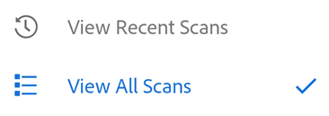
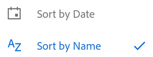
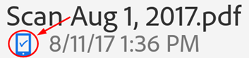
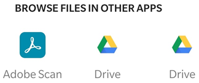
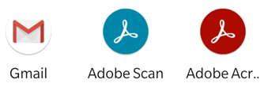

# Finding files {#finding-files}

Adobe Scan provides several options for finding and viewing files. You can: 

## View recent files or all scans {#view-recent-files-or-all-scans}

The Adobe Scan home screen displays a list of your recent scans. To switch between your Recent file list and All Scans list: 

1. Tap 
1. Tap **View Recent Scans** or **View All Scans**. 

## Sort by name or date {#sort-by-name-or-date}

When in the All Scans view, you can sort your files by file name or by scan date. A check shows you the current sort method. 

1. Tap 
1. Tap **Sort by Name** or **Sort by Date**. 

## Search for files {#search-for-files}

Search for any file by filename. From either the Recent or All Scans views: 

1. Tap  
1. Enter search text to find a file. As you enter text, matching results automatically appear in the file list.
1. Tap on a search result to preview the file.

## Copy files to device {#copy-files-to-device}

File context menus provide an option for you to save the file to your device. Local files are available for  for offline use. Local files are associated with an "offline badge (icon). 

To save a file locally: 

1. From any document list, tap 
1. **Copy to Device**. 

   >[!NOTE]
   >
   > Local PDFs appear with an offline badge if your device does not have Internet connection. 

## Access scans from other apps {#access-scans-from-other-apps}

Any app that supports working with PDF  can access the Scan app's PDF list. This allows you to attach, view, and perform other supported actions within those 3rd party apps. 

1. Open any app that supports working with PDF.
1. Initiate an action that allows you to find a PDF file; for example, viewing or attaching a PDF.
1. In the **Open from** menu, choose the Scan App. 
1. Tap the local PDF.

For example, from the Gmail app: 

1. Tap the paperclip to start the attachment workflow. 
1. In the **Open from** menu, choose Adobe Scan from the list of file providers.  
1. Find and tap the file you need. 

Note that clould-based files as well as files on other devices are not available via this method. 

## Open gallery images in Adobe Scan {#open-gallery-images-in-adobe-scan}

From the gallery, open photos directly in the scan app. 

1. Open your photo gallery. 
1. Select one or more images. 
1. Tap 
1. Tap Adobe Scan. 

