# Scanning {#scanning}

The free Adobe Scan app turns your device into a powerful portable scanner that recognizes text automatically (OCR). Capture new images with your camera or grab any image from your device. The app converts images to PDF and saves them to Adobe Document Cloud. By default, the app automatically converts image text to real text  via optical character recognition (OCR). 

## Scanning: Quick steps {#scanning:-quick-steps}

If auto-capture is enabled, simply open the app, wait for the capture, and tap on the thumbnail to view and/or edit your scan. 

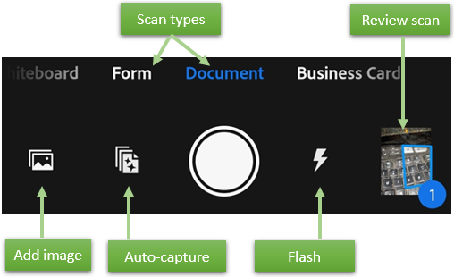

## Scanning from the capture window {#scanning-from-the-capture-window}

To scan a document:

1. *Optional*: :ref:`optional` include setting the flash, selecting the document type, and so on. 
1. Invoke a scan. The app has two capture modes: 

    *  By default, auto-capture is enabled, and on startup the app displays the capture screen and  tries to detect a document. 
    *  If auto-capture is disabled, center a document in window and tap the capture button.

1. Follow the on screen hints. The app uses auto crop and image cleaning to improve scan quality. Messages appear on the screen as follows:

    * *Looking for document*: The app is looking for the document and trying to detect its boundaries.
    * *Capturing... hold steady*: Edge detection can see the entire document.
    * *No document found. Capture manually*: The app cannot detect the document edges. 
   
1. Edit your scan as described below. 
1. Tap **Save PDF** to automatically convert your scan to a PDF and save to Adobe Document Cloud.

 

### Optional steps {#optional-steps}

Use the options on the capture screen to control how you scan : 

| Item | Description |
| --- | --- |
| Document type | Streamline your workflow by selecting one of the :ref:`scantype`. |
| |flashiconon| | If your device has a flash, you can set it to always on |flashiconon|, always off |flashiconoff|, or auto |flashiconauto| (only use in dark settings). |
| |autoscan| | Toggle auto capture on |autoscan| and off |autoscanoff|. |
| |scanaddicon| | Add an existing photo or document to your current scan collection |

### Document types {#document-types}

Selecting a scan type changes the scan name as well as how the app captures the scan. For example, the app captures the entire camera view for a whiteboard but uses boundary detection when capturing a business card.

Whiteboard:

* File name: Whiteboard  + (date)
* Full screen capture
*  shown as the 3rd option on file card

Form:

* File name: Form  + (date)
* Boundary detection
*  shown as the 3rd option on file card

Document:

* File name: Scan  + (date)
* Boundary detection
*  shown as the 3rd option on file card

Business Card:

* File name: Business Card  + (date)
* Boundary detection
*  shown as the 3rd option on file card

## Scanning from a file list {#scanning-from-a-file-list}

You can initiate a new scan from any file list (Recent and All Scans). Simply tap the plus, and choose whether 

* Tap  to scan an image from your photo library. 
* Tap  to capture a new scan with your camera. 

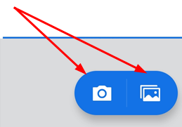

## Importing from your gallery {#importing-from-your-gallery}

Scans can include existing images from the device gallery. Simply open your gallery, tap , and tap . 

When the image opens in the scan app, edit, rename, and save your scan as usual. 

## Edit your scan {#edit-your-scan}

When you're finished scanning, tap the thumbnail in the lower right-hand corner to enter **Review Mode**. From here, you can tap **Save PDF** or modify your scans by tapping  and choosing one of the edit options from the bottom menu. 

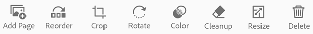

## Add photos to existing scans {#add-photos-to-existing-scans}

While in Review mode, browse your device for images and documents that you can add to your current scan:

1. Tap 
1. Take another photo or select a file from your device.

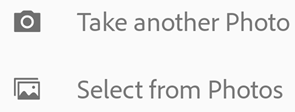

## Reorder pages {#reorder-pages}

While in Review mode, you can reorder pages 1 or more pages: 

1. Tap 
1. Drag and drop pages to new locations.
1. Tap 

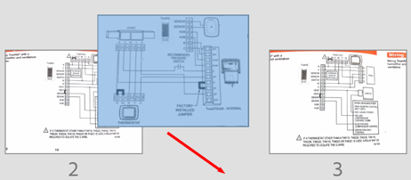

 

## Crop pages {#crop-pages}

### Adjusting borders {#adjusting-borders}

While in Review mode, you can easily crop any page (adjust the borders):

1. Navigate to the page you want to modify.
1. Tap 
1. Drag the crop handles to resize the scan area. You can also: 

    *  **Auto-Detect**: Let the app automatically position the crop borders.
    *  **No Crop**: Reset the auto crop location.  
    *  **Rotate**: Rotate the scan before or after cropping.
 
1. Tap 

### Cropping multiple pages {#cropping-multiple-pages}

To navigate through and crop a multi-page scan, use the forward and back arrows. 

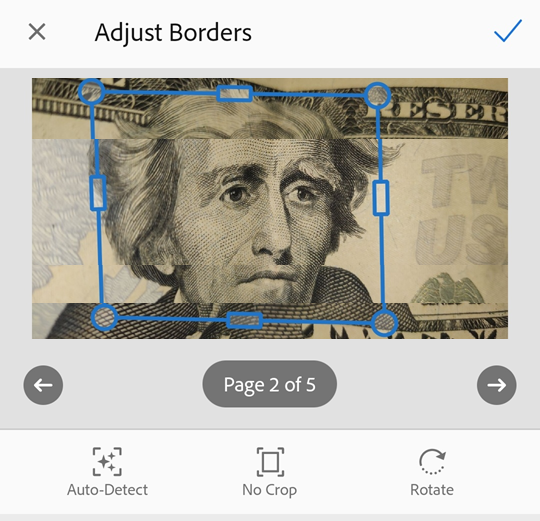

### Using the crop magnifier {#using-the-crop-magnifier}

The app provides a crop magnifier to help you precisely place border corners. To use it, press any corner crop handle. The magnifier automatically shows a zoomed in view of the current location.

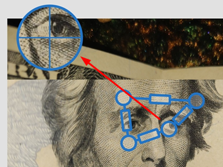

 

## Rotate pages {#rotate-pages}

While in Review mode, you can rotate pages any or all scanned pages. 

1. Navigate to the page you want to modify.
1. Tap 
1. Repeat as needed for other pages.
1. Tap **Save**. 

  

## Adjust the color {#adjust-the-color}

While in Review mode, you can adjust the color of any page.

1. Navigate to the page you want to modify.
1. Tap 
1. Choose your color options for the current page. You can: 

    * Use the original color.
    * Use auto color to let the scan app make the adjustments. 
    * Select grayscale to remove color. 
    * Select whiteboard to increase the contrast.

1. To apply the setting across multiple pages, enable **Apply to all pages**. 
1. Tap **Save**. 

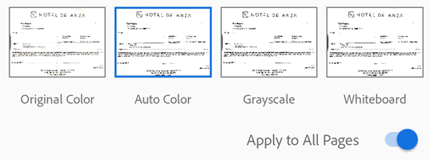

## Cleanup the image {#cleanup-the-image}

While in Review mode, you can erase unwanted artifacts, fuzzy images, or any other unwanted content. The "erase" action is essentially filling a selected area with a color you select (thus hiding that area). 

You can perform image cleanup on a new scan or cleanup the image on an existing scan. 

1. Navigate to the page you want to modify.
1. Tap 
1. Select your fill color:

    * **Fill with surrounding color**: Use an app-selected background image as a brush color. 
    * **Tap the square**: Choose a color from the color picker popup. 
    * **Tap the eyedropper**: When the moveable eyedropper appears, move it over a color and tap 

1. Zoom the image in and out as needed. 
1. Swipe your finger over the area to erase an area. 
1. Tap 

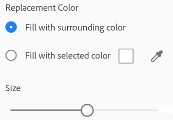

## Resize pages {#resize-pages}

It's easy to adjust the page size in review mode. For example, you can select A4 Portrait or another size that suits your printing needs. 

1. Tap 
1. Navigate to the page you want to delete.
1. Resize the page. Repeat this step for any page.
1. Tap 

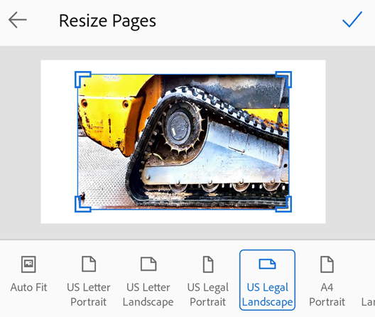

 

## Delete pages {#delete-pages}

While in Review mode, you can delete any number of pages. 

1. Navigate to the page you want to delete.
1. Tap 
1. Confirm you want to delete the page.

## Canceling a scan or edit {#canceling-a-scan-or-edit}

Canceling a scan or edit shows a confirmation dialog. Tap **Discard** to cancel. 

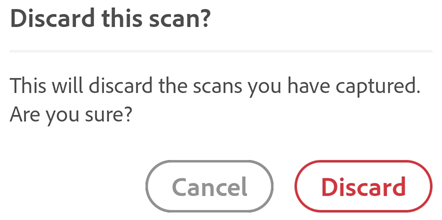

If you cancel a scan and the last page is a captured image (not imported), the dialog provides options for adjusting document borders, retaking the last photo, and disabling auto-capture.

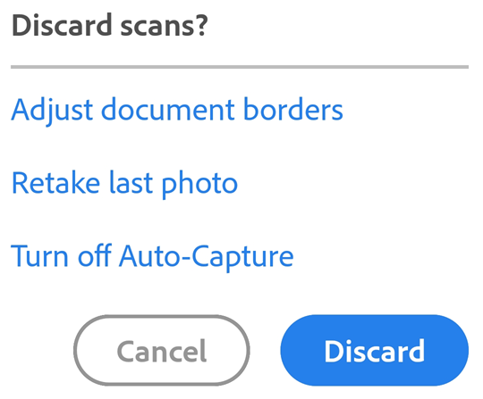

## Save as PDF {#save-as-pdf}

Once you're satisfied with the scan, you can rename or save the PDF: 

* Tap **Save PDF** to automatically convert your scan to a PDF and upload it to Adobe Document Cloud. 
* Tap  or file name to edit the default name. 

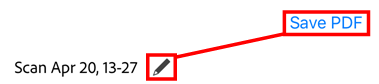

While in rename mode, you can customize the name as well as change the default filename used for all scans. 

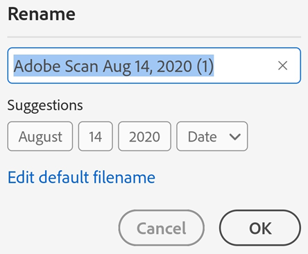

## Live edge boundary detection {#live-edge-boundary-detection}

The Scan app automatically tries to detect document boundaries. Live edge boundary detection and capture hinting behave differently in auto-capture mode and manual capture mode: 

* Auto-capture mode: When the app detects a document, a blue dots identify document corners. The  "Capturing... hold steady" hint appears when the app is relatively certain a complete document is in range. 
* Manual mode: Simply tap the capture button when ready.

## Printing {#printing}

See :ref:`print`
