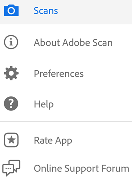
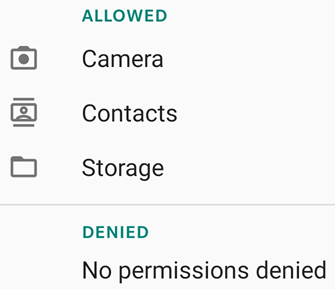
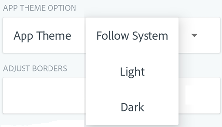
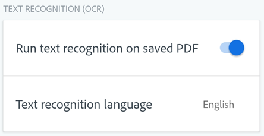
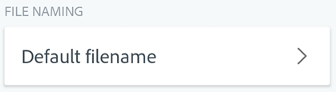
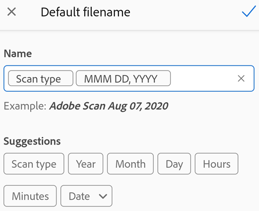
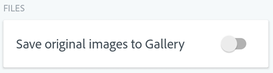
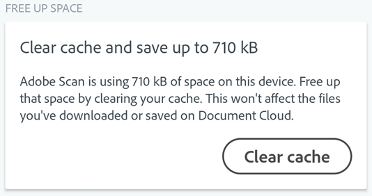
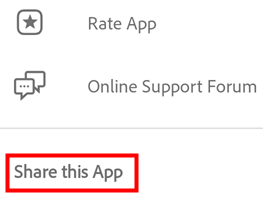
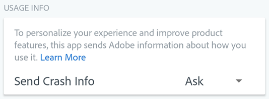

  
---
title: Adobe Scan DC for Android
solution: Acrobat DC
---

# Settings {#settings}

Adobe Scan work in tandem with your device settings to help you pre-configure scan workflows so that your experience is better and your scans more efficient.

To change your settings: 

1. Open the app and log in. 
1. Tap  to dismiss the capture screen.
1. Tap 

Settings reside under **Preferences** and **About Adobe Scan**. 

## Setting permissions {#setting-permissions}

Providing Adobe Scan with access to your camera is required. Allowing storage of local files and providing access to your contacts also streamlines workflows. 

If you have not preconfigured permissions during the install, when the app needs access to the camera or other device functionality, you will be prompted to provide access. 

You can grant or revoke permissions whenever you like: 

1. Go to your device's settings. 
1. Tap **Apps > Adobe Scan > Permissions**. 
1. Tap the permission you want to enable or disable.

## Theme: light and dark mode {#theme:-light-and-dark-mode}

The app supports themes on Android versions that support dark mode. Choose between light or dark mode as follows: 

1. Tap  > **Preferences**. 
1. In the App Theme box, tap the drop down arrow. 
1. Choose one of the following: 

    * Follow System: The default for Android 10 and later. 
    * Light: The standard theme usually displayed by Auto.
    * Dark: The default when the Battery Saver is active.

## Adjusting borders {#adjusting-borders}

You can configure the capture workflow so that the border adjustment handles appear after each capture. When enabled, the crop handles appear, and you can crop the image on-the-fly prior to another scan or reviewing the entire scan. 

1. Tap  > **Preferences**. 
1. Disable **Let me adjust borders after each scan**.

   >[!NOTE]
   >
   > You can always adjust borders later when editing a scan.

## Text recognition settings (OCR) {#text-recognition-settings-(ocr)}

### Disabling text recognition {#disabling-text-recognition}

By default, the app automatically converts image text in scans to actual text (optical character recognition or OCR). All scans start out as an image, and conversion to text allows you to edit, markup, and work with text. You can disable this feature.

1. Tap  > **Preferences**. 
1. Disable **Run text recognition on saved PDF**.

   >[!NOTE]
   >
   > OCR does not run on scans longer than 100 pages. 

### Text recognition language {#text-recognition-language}

By default, the text recognition language is set to the language of your device. Change the default as follows:

1. Tap  > **Preferences**. 
1. Tap **Text recognition language**.
1. Tap your language. 

Supported languages include: English, Dutch, Japanese, Finnish, Norwegian, Swedish, French, Spanish, Brazilian Portuguese, Italian, German, Traditional Chinese, Simplified Chinese, Korean, Turkish, Russian, Czech, and Polish. 

 

## Set default file name {#set-default-file-name}

The scan app names all files "Adobe Scan (current date)" by default. However, you can change the title, date format, and add any string as needed. Custom names can help you organize and find files. 

1. Tap  > **Preferences**. 
1. Tap **Default Filename** in the File Naming box.

1. Place your cursor in the **Name** text field and delete or add text. Tap any **Suggestion** to automatically add that item. 

## Save scans to gallery {#save-scans-to-gallery}

By default, your scans are saved to Adobe Document Cloud as PDF. If you want to save original scans (images) to your device gallery, enable **Save original images to Gallery**:

1. Tap  > **Preferences**. 
1. Enable **Save original images to Gallery**.

## Enabling cellular data usage {#enabling-cellular-data-usage}

By default, cellular data usage is enabled. To disable cellular data: 

1. Tap  > **Preferences**. 
1. Disable **Allow cellular data usage**.

## Clearing the cache {#clearing-the-cache}

The Scan app uses some device storage. You can clear the cache without affecting local or cloud based scans at anytime.

1. Tap  > **Preferences**. 
1. Tap **Clear cache**.

## Share the Scan app {#share-the-scan-app}

You can now easily share the Scan App with anyone. Tap  **> preferences > Share this App** to send an app download link via email, WeChat, Text, and so on. 

## Product improvement program {#product-improvement-program}

By default, the app sends usage data to Adobe so that the engineering team can improve the product and provide you with a more personalized experience. To enroll or unenroll:

1. Tap  > **Preferences**. 
1. Toggle **Send Usage Info** on or off. 

## Share crash details {#share-crash-details}

You can help with product development by automatically sending crash logs to the Adobe Scan team when your app crashes. The team uses crash details to design bug fixes and updates. 

1. Tap  > **Preferences**. 
1. Tap the **Send Crash Info** drop down list.
1. Set the value to *Ask*, *Always*, or *Never*. 

## Capture screen settings {#capture-screen-settings}

### Auto scan {#auto-scan}

Enabling auto scan allows the app to automatically detect borders and capture images. Crop handles immediately appear on the capture so that you can adjust on the fly. Disabling auto scan allows you to quickly tap and scan multiple page; in this case, you'll adjust borders later. 

Enable and disable auto-capture from the capture screen: 

1. Initiate a scan. 
1. Tap  **Auto-Capture On**.

When disabled, the icon changes to  **Auto-Capture Off**. To capture an image, tap the shutter button.

### Controlling the flash {#controlling-the-flash}

For devices equipped with a flash, you set it to always on, always off, or auto (only use in dark settings):

1. Initiate a scan. 
1. Tap the icon to toggle through the options: 

    * 
    * 
    * 

An *A* appears next to the flash icon when set to automatic.
