# Working with Scans {#working-with-scans}

Adobe Scan offers a rich set of features for working with your scans. You can: 

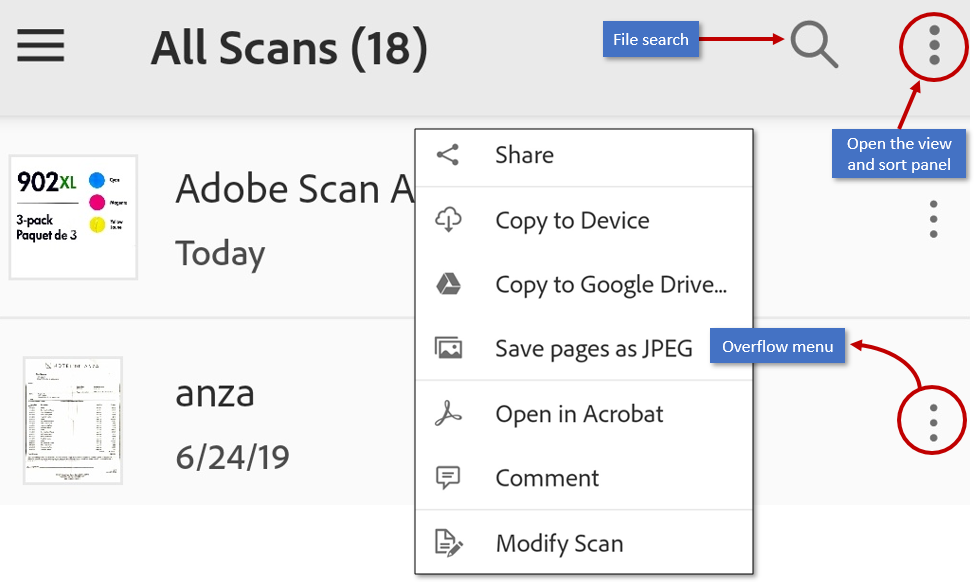

## Copy files to your device {#copy-files-to-your-device}

When you save a scan, it automatically uploads to Document Cloud. You can save a copy locally as follows: 

1. From any file list, tap , or open a file and tap  
1. Tap **Copy to Device**. 

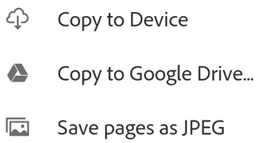

## Save files to the cloud {#save-files-to-the-cloud}

When you save a scan, it automatically uploads to Document Cloud. However, you can save to 3rd party clouds such as  Google Drive and Dropbox as well. When you've installed a cloud storage provider, Adobe Scan automatically detects the app and modifies its menu to show the save options:  

1. From any file list, tap , or open a file and tap  
1. Tap **Copy to ...**. 
1. Tap your cloud storage provider. 

..  note:: If you only have one storage app installed, the menu item says *Copy to (provider name)*.

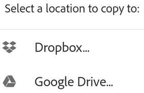

## Save pages as JPEG {#save-pages-as-jpeg}

While files automatically save as PDF, you can also save individual pages as JPEG files to your gallery. 

1. From any file list, tap , or open a file and tap  
1. Tap **Save pages as JPEG**. 

Every page of your scan automatically saves to your gallery in JPEG format. 

## Select and copy text {#select-and-copy-text}

You can select and copy text from any scan that's been taken with OCR enabled. Simply: 

1. Open a scan.
1. Long press the text you need to copy. 
1. Drag the handles to select the copy boundaries. 
1. Tap **Copy**.

## Select multiple files {#select-multiple-files}

Select multiple files from the All Scans tab after entering Select Files mode. 

To delete or share multiple files:

1. Long press any file, or tap  **> Select**. 
1. After the app enters multiple selection mode, tap files to select them. 
1. Tap the needed action icon (share or delete).

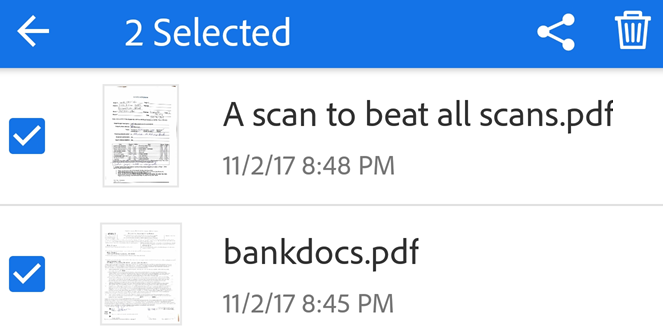

## Add business card scans to contacts {#add-business-card-scans-to-contacts}

For scans the app recognizes as a business card, you can save contact information from the card to your contacts list. If the app detects a business card on any scanned page after the text recognition process completes, a Save Contact icon appears in the bottom menu as well as the document card thumbnail. On the preview screen, you may also see a notification that says "This looks like a business card. . .".

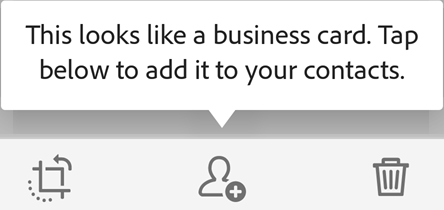

To add the scan data to your contacts: 

1. Tap 
1. When the New Contact form appears, enter or edit the details. The scan appears at the top so you can verify the information. 
1. Tap 

Note that the  appears in several locations if the app believes the image to be a business card, including thumbnail previews, the overflow menu, and so on. 

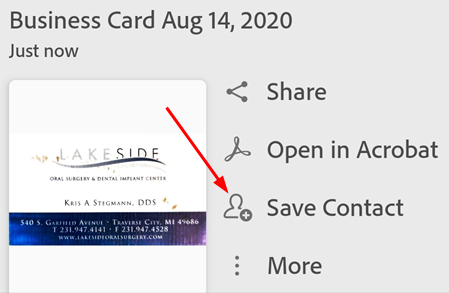

   >[!NOTE]
   >
   > If you've captured more than one business card in a single scan, you can select which cards to add to your contacts. 

## Share links to files {#share-links-to-files}

You can share a link to a file stored in Adobe Document Cloud: 

From the Recent tab: 

1. Tap  **Share**. 
1. Tap   **Share Link**.
1. Choose one of the ways to share a link, and complete the workflow.

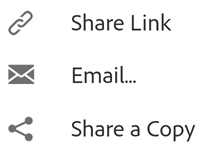

   >[!NOTE]
   >
   > Sharing by email also shares a link to a file.

From the All Scans tab: 

1. Tap   for any file (either on the thumbnail or in the file list). 
1. Tap  **Share Link**.
1. Choose one of the ways to share a link, and complete the workflow.

   >[!NOTE]
   >
   > Select multiple files from the All Scans tab after entering Select Files mode. To do so, either long press any file or tap  **> Select**. 

## Share file copies {#share-file-copies}

You can share file copies: 

From the Recent tab: 

1. Tap  **Share**. 
1. Tap  **Share a Copy**.
1. Choose one of the ways to share a copy, and complete the workflow.

From the All Scans tab: 

1. Tap   for any file (either on the thumbnail or in the file list). 
1. Tap  **Share a Copy**.
1. Choose one of the ways to share a copy, and complete the workflow.

   >[!NOTE]
   >
   > Select multiple files from the All Scans tab after entering Select Files mode. To do so, either long press any file or tap  **> Select**. 

## Email scans {#email-scans}

You can email a link to a scan directly from the app as follows:

From the Recent tab: 

1. Tap  **Share**.
1. Tap  **Email**.
1. Choose an email app on your device, and complete the workflow.

From the All Scans tab:

1. Tap   for any file (either on the thumbnail or in the file list). 
1. Tap  **Email**.
1. Choose an email app on your device, and complete the workflow.

   >[!NOTE]
   >
   > Select multiple files from the All Scans tab after entering Select Files mode. To do so, either long press any file or tap  **> Select**. 

## Open in Acrobat Reader {#open-in-acrobat-reader}

If you have Acrobat Reader installed, you can open a scan in that app to add comments, edit the file, and so on. 

* From the Recent list, select a file and tap 
* From the All Scans list, tap  and then tap 

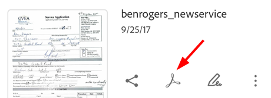

## Commenting and sharing files {#commenting-and-sharing-files}

Commenting is a free service provided via Acrobat Reader. The feature allows you to share files, add comments (sticky note), and markup a PDF with underlines, strikethrough, and so on. To use this feature, simply install Acrobat and: 

1. Open a scan. 
1. Tap 
1. Tap **Comment**. 

The file opens in Acrobat.

## Create Fill & Sign forms {#create-fill-&-sign-forms}

Fill & Sign forms are PDF forms you can create on any platform, including mobile devices. Fill & Sign form fields are similar to annotations: you can select a form element from the form tool bar and tap anywhere on the PDF to place it. 

If you've installed Acrobat Reader, tap  to open your PDF scan in that app. You can then add form fields such as text fields and check boxes. You can fill out the fields, or you can send the file to others for fill in. 

1. From any file list, tap  next to any file.
1. Tap 

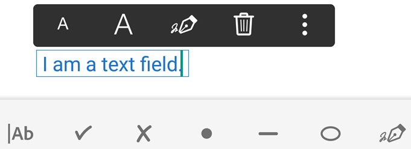

1. When the PDF opens in Acrobat, select a form tool; for example, a text field or checkbox. 
1. Enter data. By default, the app suggests entries for text fields.
1. Tap  to exit Fill & Sign mode. 

Fill & Sign on Android supports creating and editing forms, automatic form fill-in based on suggestions, clearing form data history, signing, pasting copied text into text fields, undo/redo, and deleting form fields. For details, refer to the on-device Acrobat Reader Help.

## Rename a file {#rename-a-file}

Before saving your scan as PDF, rename your file by tapping 

To rename a file at a later date: 

1. From any file list, tap  > **Rename**.
1. Enter a new name. 
1. Tap **Rename**.

## Modify existing scans {#modify-existing-scans}

You can modify scans after they are converted to PDF. The feature allows you to organize, crop, and enhance scans at any time. To use this feature: 

1. From any file list, tap  next to any file.
1. Tap 
1. Modify your scan as needed. 
1. Tap **Save**.

Note that you cannot modify scanned files which have been altered outside of Adobe Scan. For example, if you have opened a scan in Acrobat and have added comments, added attachments, organized pages, and so on, Adobe Scan will not be able to modify that file.

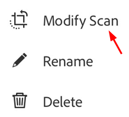

   >[!NOTE]
   >
   > For details about editing (modifying) scans, see :ref:`editscans`.

## Add photos to a scan {#add-photos-to-a-scan}

Integration with the device photo library allows you to easily browse your photo library and add images to new or existing scans. The document detection feature allows you to tell the app to distinguish documents from selfies, artwork, and other non-document photos. By showing you document-specific images first, it's easier to find and work with what you actually need.

There are two methods:  

* Add images during a current capture: tap  on the capture screen, or 
* Add images to an existing scan: 

    1. Open a scan. 
    1. Tap  >  in the bottom menu.
    1. **Take another Photo** or **Select from Photos**. 
    1. Tap a thumbnail to select one or more files. 
    1. Tap  

    .. note:: If you select an image from your photos, enable **Show Only Documents** to remove images and other non-document items from the list. Tap **Show All Photos** to view your entire gallery.
 
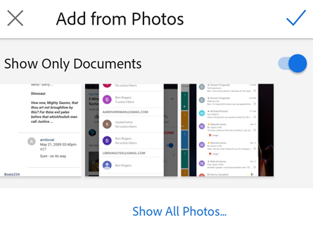

## Copy a file to your device {#copy-a-file-to-your-device}

See :ref:`offline`

 

## Printing {#printing}

Printing uses your device's printing capabilities. You can set up a printer ahead of time or at the time of printing.

1. Open a PDF. 
1. Tap  and then  
1. In the Printer Options dialog, select a printer.
1. Set your printing preferences such as the number of copies, paper size, color, etc.
1. Tap **Print**.

   >[!NOTE]
   >
   > If no printer is found, you will be prompted to save the PDF to your device.

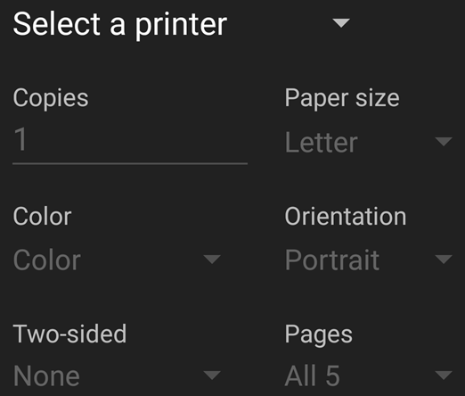

