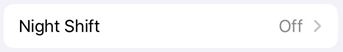
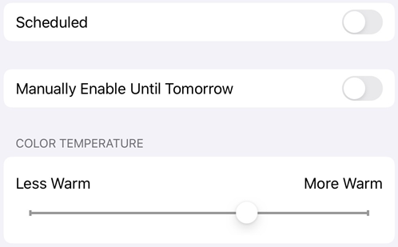
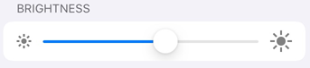
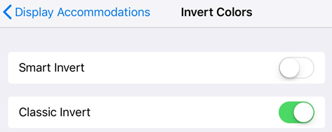
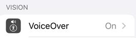

# Accessibility {#accessibility}

iOS devices support a number of accessibility features not listed here. For more information, refer to the [Apple support site](https://support.apple.com/en-us/HT204390). You can also check your accessibility settings by going to your device's settings screen and tapping **Accessibility**.  

## Visual features {#visual-features}

### Reading in low light {#reading-in-low-light}

You can use your device's night shift feature to improve readability in low light conditions. Doing so reduces eye strain and extends battery life. 

1. Go to your device's settings screen. 
1. Tap **Display and Brightness**. 
1. Tap **Night Shift**. 

1. Configure the settings. Depending on your OS version, you can schedule night shift mode, manually enable the feature, and control the overall hue.

### Display brightness {#display-brightness}

Set your display's brightness to enhance readability as needed. 

1. Go to your device's settings screen. 
1. Tap **Display and Brightness**. 
1. Set the brightness level. 

### Inverting colors {#inverting-colors}

Devices on OS 11 and later include an option to invert colors. 

1. Tap **Settings > General** (pre iOS 13).
1. Tap **Accessibility**.
1. Tap **Display Accommodations**.
1. Tap **Invert Colors**.
1. Choose one: 

    * **Smart Invert** inverts most colors but leaves images, media, and some apps in their original state.
    * **Classic Invert** inverts everything.

On iOS 13 and later: 

1. Tap **Settings**.
1. Tap **Accessibility**.
1. Tap **Display and Text Size**.
1. Enable features such as: 

    * **Smart Invert** inverts most colors but leaves images, media, and some apps in their original state.
    * **Classic Invert** inverts everything.

   >[!NOTE]
   >
   > You can also change the contrast, text size, and other display features from this screen. 

### Dark mode {#dark-mode}

For users of iOS 13+, the October, 2019 release supports dark mode. Dark mode's high contrast display may improve readability in low light environments as well as extend battery life. For some users, dark mode is an important accessibility feature that maintains color meaning and preserves image representation.

1. Go to your device's settings screen. 
1. Tap **Display and Brightness**. 
1. Choose light or dark mode.
 

## Audio features {#audio-features}

### Voiceover {#voiceover}

The app supports VoiceOver, the iOS built-in screen reader. VoiceOver allows someone with a visual impairment to use simple gestures to hear PDF content. To enable VoiceOver: 

1. Go to your device's settings screen. 
1. Tap **Accessibility**. 
1. Tap **VoiceOver**, and enable the feature.  

## Gesture features {#gesture-features}

The app supports the standard VoiceOver gestures as described in [Apple's documentation](https://support.apple.com/guide/iphone/learn-voiceover-gestures-iph3e2e2281/ios).