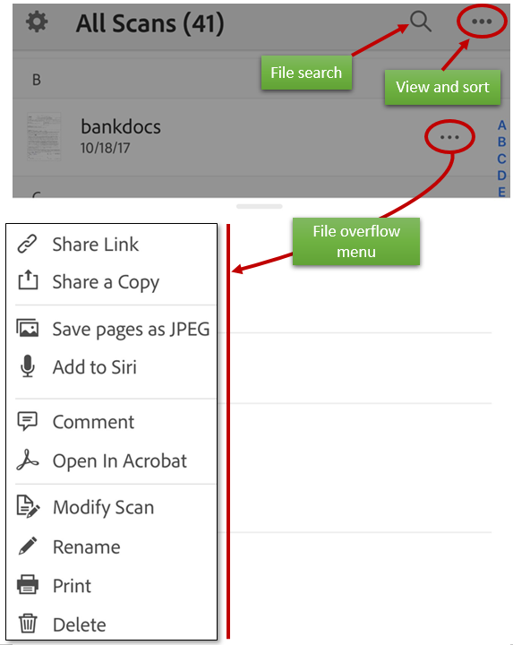
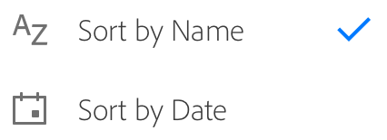
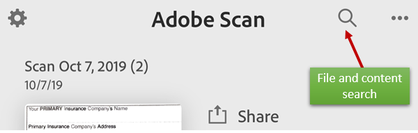
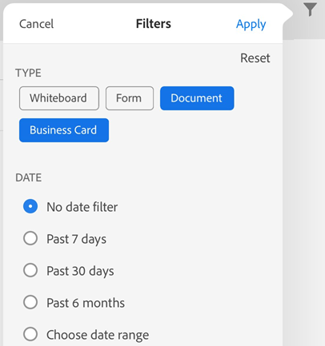
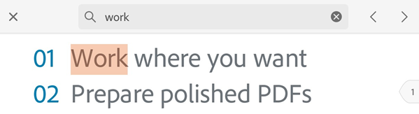
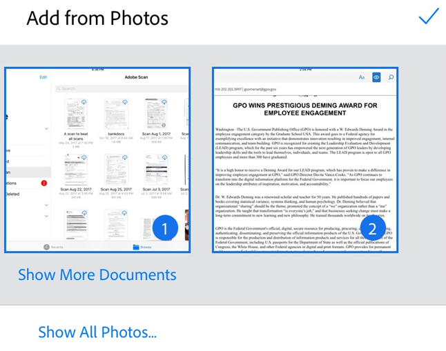
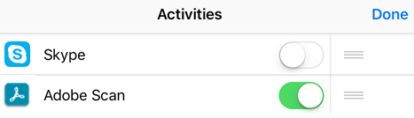
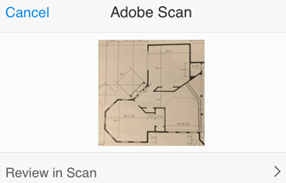

# Finding files and content {#finding-files-and-content}

Adobe Scan offers a number of ways to find and sort files. You can: 

## View recent files or all scans {#view-recent-files-or-all-scans}

The home screen shows all your scans. To change your file view, tap   and: 

 **Recent** to see your latest scans or **All Scans** to view all files.

## Sort by name or date {#sort-by-name-or-date}

When in the All Scans view, you can sort your files by file name or by scan date. A check shows you the current sort method. 

1. Tap **All Scans** to see all your files. 
1. Tap 
1. Tap **Sort by Name** or **Sort by Date**. 

## Search files and content {#search-files-and-content}

From the home screen (a scan is not open), search for files by filename or content. The January, 2020 release introduced advanced searching for content across all files. You do not need to have a file open to find file content. 

1. Tap  
1. Enter text in the search field. 
1. Tap **Search**. 
1. Tap on a search result to preview the file.

**Tip**: Tap  to filter your search results. 

## Filter search results {#filter-search-results}

Search files by file type as well as by date range with the search filter. You can use the search filter with or without a search term. 

1. Tap 
1. Select a document type and/or a date range. 
1. Tap **Apply**. 

## Search within a file {#search-within-a-file}

When you have a file open, you can search for file text in any **saved** scan. 

Keep in mind scans start out as images. Since optical scan recognition (OCR) converts your scan to text, the initial quality of your scan may affect your ability to search for and find text. 

1. Tap  
1. Enter text in the search field. 
1. Tap **Search**. 

The shows the first found item. Tap the previous and next arrows to navigate through the search results.

## Access scans from other apps {#access-scans-from-other-apps}

Any app that supports working with PDF can access the scan app's PDF list. This allows you to attach, view, and perform other supported actions within those 3rd party apps. 

## Import photos to Adobe Scan {#import-photos-to-adobe-scan}

Document detection for the add-from-photos feature means the app tries to distinguish documents from selfies, artwork, and other non-document photos. By showing you document-specific images first, it's easier to find and work with what you actually need. Integration with the device photo library allows you to easily browse your photo library and add images to new or existing scans. 

To access this feature: 

1. Tap  on the capture screen or file browser. While reviewing a current scan, you can also tap  in the bottom menu and tap **Select from Photos**. Photos from last month appear by default.
1. If you don't see what you need, tap **Show More Documents** or **Show All Photos**. 
1. Tap a thumbnail to select one or more files. 
1. Tap the checkmark to finish adding the photo to your scan. 

## Open Photo images in Adobe Scan {#open-photo-images-in-adobe-scan}

From Photos, import an image into the scan app. 

1. Open your photos. 
1. Select one or more images. 
1. Tap 
1. Tap . If you don't see the Adobe Scan icon, tap **More**, enable Adobe Scan, and tap **Done**. 

1. Tap **Review in Scan**.

