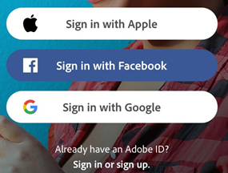
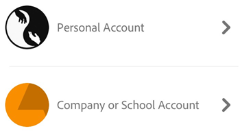

# Adobe Scan

Adobe Scan for iOS and Android is a mobile scan companion to Adobe's suite of Acrobat DC apps. Adobe Scan delivers enterprise-class scanning features such as: 

* Automatic scanning (tap free!) 
* Automatic OCR with multiple language support
* Rich editing, including color correction, page rotation, cropping, and so on
* Integration with other apps and cloud storage solutions

## Getting started {#getting-started}

Adobe Scan requires that you log in with a supported ID  since features such as conversion of text in images to actual text (optical character recognition) use services in the Adobe Cloud. Use an existing Adobe, Google, or Facebook ID or create a new Adobe ID at ``https://acrobat.adobe.com/us/en/acrobat.html``. 

* Install: 

    * **Mobile**: Download and configure the free Adobe Scan mobile app from the Apple App Store, Google Play Store, or Samsung Galaxy Store.
    * **Web**: Bookmark the Adobe Document Cloud website so you can access your files from any location. 
    * **Desktop**: Sign in to Acrobat on your desktop so that your files are always available in Acrobat. 
    
* Configure: Once you've installed the app, make sure it's set up to do what you need by configuring the :ref:`settings` in the app's preference panel as well as those on the capture screen. Some of the features you can control include: 

    * Auto-capture
    * Auto-flash
    * Auto OCR
    * Text recognition language
    * Cellular data usage

## Signing in {#signing-in}

The scan app requires that you sign in to Document Cloud so that your scans may be converted to PDF, saved to the cloud, and synced across devices. You can sign in with your personal ID or with an ID provided by your organization. Note that signing in also signs you in to Acrobat Reader.

1. Open the app. 
1. Choose a sign in option: 

    * Tap Facebook, Apple, or Google, or:
    * Tap **Sign In or Sign Up** to use a new or existing Adobe ID.
 

### Signing in with a company or school ID {#signing-in-with-a-company-or-school-id}

Most users have one login credential and will only see one set of screens. However, if you are part of an organization that has provided you with another log in, you may be prompted to choose between an personal ID or an company/school ID.

* Tap **Sign In or Sign Up** to use a new or existing Adobe ID.
* Enter your email address. 
* Select an account. 
* Log in with your organization credential. 

## Signing out {#signing-out}

Signing out disables access to online documents and workflows. To sign out, tap **Settings > Sign Out**.