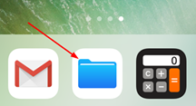
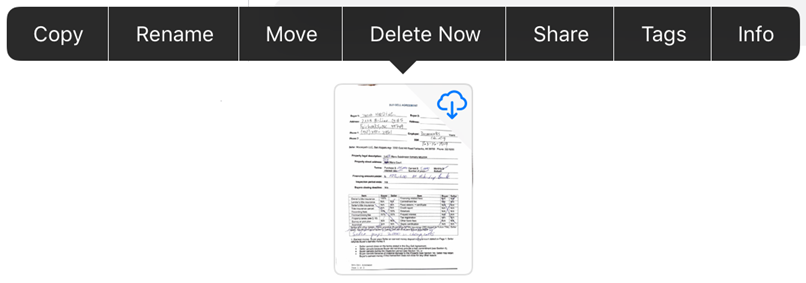

# Files app integration {#files-app-integration}

iOS 11 and later provides a new Files app that allows you to easily find, organize, and manage all of your files, including your Adobe Scan files. Available files include not only local files on your device, but also files on other iOS devices as well as cloud services such as Adobe Document Cloud. Adobe Scan's support for the Files app means you have greater control and ease of access for all your files and scans no matter where they reside. 

For additional details beyond what appears below, see https://support.apple.com/en-us/HT206481. 

## Open the Files app {#open-the-files-app}

To get started, tap the Files app icon. 

## Save files locally {#save-files-locally}

Tap Adobe Scan in the left-hand menu or under Locations to see your scans. Note the following: 

* Tap the Adobe Scan folder to see you scan files. 
* Files in the cloud have a cloud icon in the upper right hand corner of the file thumbnail. 
* Local files have no icon. 
* Tap any thumbnail to download and open a file. The file will now be available for offline use. 

   >[!NOTE]
   >
   > Sometimes the Scan app doesn't appear until you tap **Edit**. 

## Manage files {#manage-files}

The Files app provides a number of features besides previewing your files and downloading for offline use. You can modify, copy, move, delete, share, and add tags. *Keep in mind that any changes you make here will also appear in Adobe Scan*. 

To perform an action, long press a thumbnail and select an item from the menu. 

## Working with multiple files {#working-with-multiple-files}

To delete or share more than one scan, select multiple files:

1. Tap All Scans.
1. Tap  **> Select**. 
1. After the app enters multiple selection mode, tap files to select them. 
1. Tap  
1. Tap **Share a Copy** or **Delete**. 

