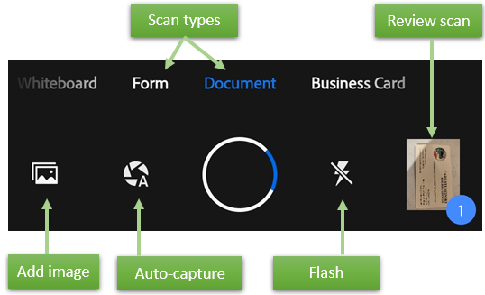
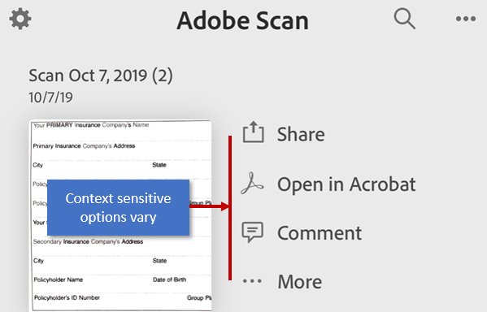
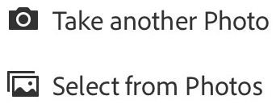
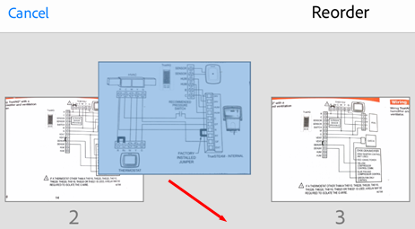
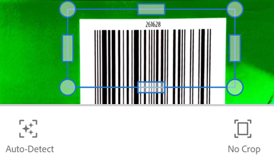
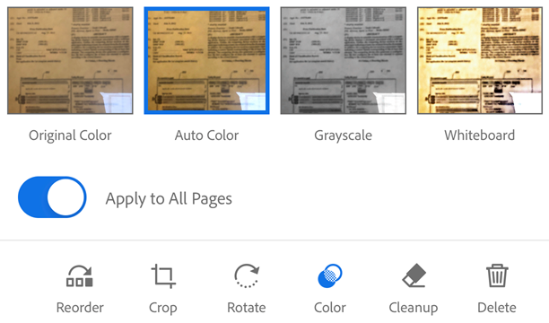
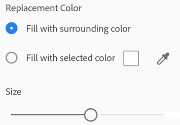
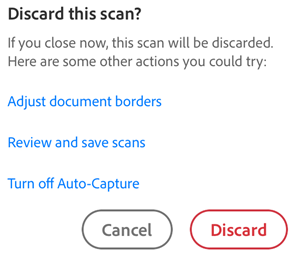
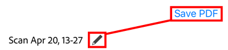
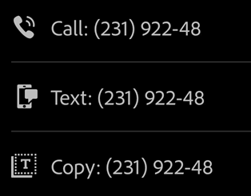

---
title:  Adobe Scan DC for iOS
solution: Acrobat DC
description: Adobe mobile app enterprise workflow features
---

# Scanning {#scanning}

The free Adobe Scan app turns your device into a powerful portable scanner that recognizes text automatically (OCR). Capture new images with your camera or grab any image from your device. The app converts images to PDF and saves them to Adobe Document Cloud. By default, the app automatically converts image text to real text  via optical character recognition (OCR).

Scan features include: 

## Scanning: Quick steps {#scanning:-quick-steps}

If auto-capture is enabled, simply open the app, wait for the capture, and tap on the thumbnail to view and/or edit your scan. 

## Device settings {#device-settings}

The scan feature requires access to your camera. If prompted, choose **Allow**. 

By default, auto-capture is enabled. Turn this setting on and off as follows: 

1. Initiate a scan. 
1. Tap 

When disabled, the icon changes to 

Note that live edge boundary detection and capture hinting behave differently in auto-capture mode and manual capture mode: 

* Auto-capture mode: When the app detects a document, a blue dots identify document corners. The  "Capturing... hold steady" hint appears when the app is relatively certain a complete document is in range. 
* Manual mode: Simply tap the capture button when ready.

## Scanning from the capture window {#scanning-from-the-capture-window}

To scan a document:

1. *Optional*: Configure flashs, select a document type, and so on. 
1. Invoke a scan. The app has two capture modes: 

    *  By default, auto-capture is enabled, and on startup the app displays the capture screen and  tries to detect a document. 
    *  If auto-capture is disabled, center a document in window and tap the capture button.

1. Follow the on screen hints. The app uses auto crop and image cleaning to improve scan quality. Messages appear on the screen as follows:

    * *Looking for document*: The app is looking for the document and trying to detect its boundaries.
    * *Capturing... hold steady*: Edge detection can see the entire document.
    * *No document found. Capture manually*: The app cannot detect the document edges. 
   
1. Edit your scan as described below. 
1. Tap **Save PDF** to automatically convert your scan to a PDF and save to Adobe Document Cloud.

 

### Optional steps {#optional-steps}

Use the options on the capture screen to control how you scan : 

| Item | Description |
| --- | --- |
| Scan type | Streamline your workflow by selecting one of the [document types](scan.md##document-types). |
| |flashiconon| | If your device has a flash, you can set it to always on |flashiconon|, always off |flashiconoff|, or auto |flashiconauto| (only use in dark settings). |
| |autoscan| | Toggle auto capture on |autoscan| and off |autoscanoff|. |
| |scanaddicon| | Add an existing photo or document to your current scan collection |

  

### Document types {#document-types}

While optional, selecting a document type prior to scanning saves you time later. The document type changes the scan name as well as how the app captures the scan. For example, the app captures the entire camera view for a whiteboard but uses boundary detection when capturing a business card. 

To help you get work done fast, the default menu options available on the preview screen and document thumbnails will vary by context. For example, a form will show the **Fill and Sign** menu item while a business card will show the **Save to Contacts** menu item. 

   >[!NOTE]
   >
   > You can configure the default file name from the app's preferences screen. 

Whiteboard:

* File name: Whiteboard  + (date)
* Full screen capture
*  shown as the 3rd option on file card

Form:

* File name: Form  + (date)
* Boundary detection
*  shown as the 3rd option on file card

Document:

* File name: Scan  + (date)
* Boundary detection
*  shown as the 3rd option on file card

Business Card:

* File name: Business Card  + (date)
* Boundary detection
*  shown as the 3rd option on file card

## Importing from your gallery {#importing-from-your-gallery}

The latest app version support importing images directly from your gallery to the Scan app. 

1. Open the gallery. 
1. Select an image. 
1. Tap the **Share** icon.
1. Tap **Adobe Scan**. 

## Edit your scan {#edit-your-scan}

When you're finished scanning, tap the thumbnail in the lower right-hand corner to enter **Review Mode**. From here, you can tap **Save PDF** or modify your scans by tapping  and choosing one of the edit options from the bottom menu. 

## Add photos to existing scans {#add-photos-to-existing-scans}

You can browse your device for images and documents that you can add to your current scan:

1. Tap 
1. Take another photo or select a file from your device.

 

## Reorder pages {#reorder-pages}

You can easily reorder pages: 

1. Tap 
1. Drag and drop pages to new locations.
1. Tap **Done**.

 

## Crop pages {#crop-pages}

While in Review mode, you can easily crop any page (adjust the borders):

1. Navigate to the page you want to modify.
1. Tap 
1. Drag the crop handles to resize the scan area.

    *  **Auto-Detect**: Let the app automatically position the crop borders.
    *  **No Crop**: Reset the auto crop location.  

1. Tap 

 

## Rotate pages {#rotate-pages}

While in Review mode, you can rotate pages any or all scanned pages. 

1. Navigate to the page you want to modify.
1. Tap 
1. Repeat as needed for other pages.

  

## Adjust the color {#adjust-the-color}

While in Review mode, you can adjust the color of any page.

1. Navigate to the page you want to modify.
1. Tap 
1. Choose your color options for the current page. You can: 

    * Use the original color.
    * Use auto color to let the scan app make the adjustments. 
    * Select gray scale to remove color. 
    * Select whiteboard to increase the contrast.

1. To apply the setting across multiple pages, enable **Apply to all pages**. 

  

## Cleanup the image {#cleanup-the-image}

While in Review mode, you can erase unwanted artifacts, fuzzy images, or any other unwanted content. The "erase" action is essentially filling a selected area with a color you select (thus hiding that area). 

You can perform image cleanup on a new scan or cleanup the image on an existing scan. 

1. Navigate to the page you want to modify.
1. Tap 
1. Select your fill color:

    * **Fill with surrounding color**: Use an app-selected background image as a brush color. 
    * **Tap the square**: Choose a color from the color picker popup. 
    * **Tap the eyedropper**: When the moveable eyedropper appears, move it over a color and tap 

1. Change the eraser size as needed.
1. Zoom the image in and out as needed. 
1. Swipe your finger over the area you want to erase. 
1. Tap .

 

## Delete pages {#delete-pages}

While in Review mode, you can delete any number of pages. 

1. Navigate to the page you want to delete.
1. Tap 
1. Confirm you want to delete the page.

## Canceling a scan or edit {#canceling-a-scan-or-edit}

Cancel an in-progress scan by doing one of the following: 

* Tap . When the Discard this Scan dialog appears, choose an option or tap **Discard**.
* Long press the thumbnail preview icon and tap the red X. You can delete one or more pages from the current scan. 

## Save as PDF {#save-as-pdf}

Once you're satisfied with the scan, you can do the following: 

* Tap  or file name to edit the default name. 
* Tap **Save** to automatically convert your scan to a PDF and then upload it to Adobe Document Cloud so that you can access the file anywhere. 

## Live edge boundary detection {#live-edge-boundary-detection}

The Scan app automatically tries to detect document boundaries. Live edge boundary detection and capture hinting behave differently in auto-capture mode and manual capture mode: 

* Auto-capture mode: When the app detects a document, a blue dots identify document corners. The  "Capturing... hold steady" hint appears when the app is relatively certain a complete document is in range. 
* Manual mode: Tap the capture button when you're ready.

## Quick actions {#quick-actions}

The latest app version supports performing common actions on your phone directly from a new scan. For example, when the app recognizes an email address or phone number, the capture screen provides buttons which allow you to email, call, or copy the captured text. This feature is is especially useful for business cards since you can quickly contact the person on the card. 

1. Scan a document with text. The scan type can be set to Document, Whiteboard, or Form. If the Scan app recognizes and email address or phone number, buttons appear on the capture screen. 
1. Tap one of the quick action buttons (email, call, select text).

1. Choose an action; for example, you can invoke a call directly from the app. 

