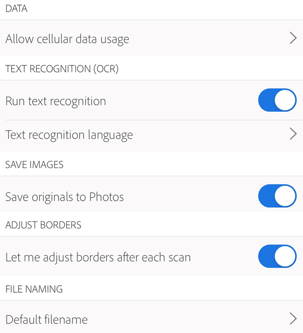
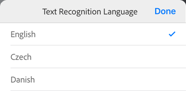
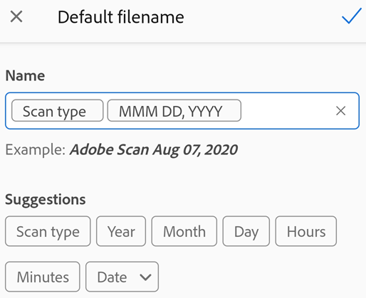
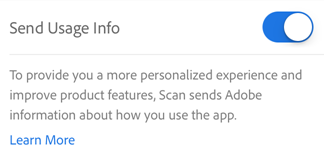
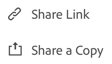
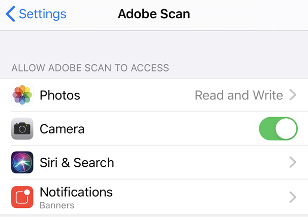
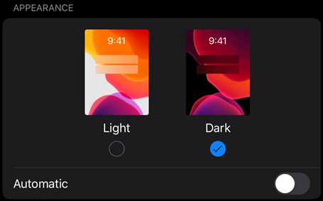

---
title:  Adobe Scan DC for iOS
solution: Acrobat DC
description: Adobe mobile app enterprise workflow features
---

# Settings {#settings}

Adobe Scan work in tandem with your device settings to help you pre-configure scan workflows so that your experience is better and your scans more efficient.

## Scan app settings {#scan-app-settings}

Adobe Scan settings allow you to control features such as cellular data usage, text recognition, and so on. To change your settings: 

1. Open the app and log in. 
1. Tap  

## Enable-disable cellular data {#enable-disable-cellular-data}

By default, cellular data usage is enabled on devices with cellular access. To disable cellular data, tap  > **Preferences > Allow Cellular Data Usage**.

When the device's settings screen opens, disable/enable Scan's ability to use cell data. 

## Text recognition settings (OCR) {#text-recognition-settings-(ocr)}

### Disabling text recognition {#disabling-text-recognition}

By default, the app automatically converts image text in scans to actual text (optical character recognition or OCR). All scans start out as an image, and conversion to text allows you to edit, markup, and work with text. You can disable this feature.

1. Tap  > **Preferences**. 
1. Disable **Run Text Recognition**.

### Setting the text recognition language {#setting-the-text-recognition-language}

By default, the text recognition language is set to the language of your device. Change the default as follows:

1. Tap  > **Preferences**. 
1. Tap **Text Recognition Language**.
1. Select your language. 
1. Tap **Done**.

Supported languages include: English, Dutch, Japanese, Finnish, Norwegian, Swedish, French, Spanish, Brazilian Portuguese, Italian, German, Traditional Chinese, Simplified Chinese, Korean, Turkish, Russian, Czech, and Polish. 

## Save scans to Photos {#save-scans-to-photos}

You can automatically save scans (images) on your device:

1. Tap  > **Preferences**. 
1. Enable **Save Original to Photos**.

 

## Adjusting borders {#adjusting-borders}

You can configure the capture workflow business cards so that the border adjustment handles appear after each capture. When enabled, the crop handles appear, and you can crop the image on-the-fly prior to another scan or reviewing the entire scan. 

1. Tap  > **Preferences**. 
1. Enable **Let me adjust borders after each scan**.

  

## Setting the default filename {#setting-the-default-filename}

The scan app names all files "Adobe Scan (current date)" by default. However, you can change the title, date format, and add any string as needed. Custom names can help you organize and find files. 

1. Tap  > **Preferences**. 
1. Tap **Default Filename** in the File Naming box.
1. Place your cursor in the **Name** text field and delete or add text. Tap any **Suggestion** to automatically add that item. 

## Product improvement program {#product-improvement-program}

By default, the app sends usage data to Adobe so that the engineering team can improve the product and provide you with a more personalized experience. To unenroll:

1. Tap  > **About Adobe Scan**. 
1. Disable **Send Usage Info**.

## Writing a review {#writing-a-review}

Reviews help us learn what we're doing right or wrong. Feedback is always welcome. To write a review: 

1. Tap  > **About Adobe Scan**.
1. Tap the text: "If you enjoy using Adobe Scan. . ."  

## Theme: light and dark mode {#theme:-light-and-dark-mode}

.. caution:: Is this on iOS? 

Choose between light or dark mode as follows: 

1. Tap  > **Preferences**. 
1. In the App Theme box, tap the drop down arrow. 
1. Choose one of the following: 

    * Auto: The default for Android 6 and later. 
    * Light: The standard theme usually displayed by Auto.
    * Dark: The default when the Battery Saver is active. Dark mode requires Android 6 or later.

## Capture screen settings {#capture-screen-settings}

### Auto scan {#auto-scan}

Enabling auto scan allows the app to automatically detect borders and capture images. Crop handles immediately appear on the capture so that you can adjust on the fly. Disabling auto scan allows you to quickly tap and scan multiple page; in this case, you'll adjust borders later. 

Enable and disable auto-capture from the capture screen: 

1. Initiate a scan. 
1. Tap  **Auto-Capture On**.

When disabled, the icon changes to  **Auto-Capture Off**. To capture an image, tap the shutter button.

### Controlling the flash {#controlling-the-flash}

For devices equipped with a flash, you set it to always on, always off, or auto (only use in dark settings):

1. Initiate a scan. 
1. Tap the icon to toggle through the options: 

    * 
    * 
    * 

An *A* appears next to the flash icon when set to automatic.

## Connecting an email app {#connecting-an-email-app}

If you've set up an email account on your iOS device, an email option appears as one of the share options in the file context menu. The  does not appear if you have not connected an email account. 

To configure an email account: 

1. Go to your device settings. 
1. Tap **Accounts and Passwords > Add Account**. 
1. Complete the account setup workflow. 

## Allowing access to device features {#allowing-access-to-device-features}

Adobe Scan requires access to your camera. After you install the app, you'll be prompted to allow camera access as well as whether or not you'd like to receive push notifications. However, you can configure permissions at a later time.

To set permissions: 

1. Go to your device's settings. 
1. Scroll to Adobe Scan. 
1. Tap the feature you want to configure.

## Dark mode {#dark-mode}

For users of iOS 13+, the October, 2019 release supports dark mode. Dark mode's high contrast display may improve readability in low light environments as well as extend battery life. For some users, dark mode is an important accessibility feature that maintains color meaning and preserves image representation better than the night mode feature.

1. Go to your device's settings screen. 
1. Tap **Display and Brightness**. 
1. Choose light or dark mode.
 

