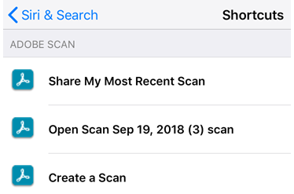
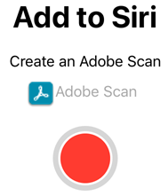
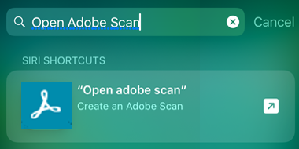

# Siri integration {#siri-integration}

If you iOS version is 12 or later, you can leverage Siri features in the latest Scan app. Support for Siri shortcuts means you can spend less time performing repetitive tasks and more time performing meaningful actions.  You can record Siri shortcuts directly from the Scan app as well as leverage Siri's capabilities from lock screen notifications, Spotlight search, and any other place on your device where Siri is available. 

 

## Siri settings {#siri-settings}

Siri is enabled by default. However, you can check your device settings to verify: 

* Change or check Siri settings by going to **Settings > Siri & Search**. 
* Change or check Adobe Scan's Siri settings by **Settings > Adobe Scan**. Verify **Siri & Suggestions**. 

   >[!NOTE]
   >
   > If the Siri setting is not visible, go to **Settings > Screen Time > Content & Privacy Restrictions > Allowed Apps**, and enable Siri & Dictation. 

## Default behavior {#default-behavior}

Siri is enabled by default, and it records common actions as well as your current context (such as your location or calendar event) to make useful suggestions about when to invoke the Scan app, open a specific PDF, and so on. Suggestions may appear on the lock screen, Spotlight search, reminders, your calendar, and other locations. Siri is capable of showing a Scan app shortcut, providing links to a specific PDF, and opening the Scan app in a particular mode. 

For example, Siri can help you: 

* Create a scan: Launch the app in capture mode in specific situations. 
* Detect documents: Launch the Scan app with automatic document detection enabled. The app tries to identify and only show documents rather than photos. 
* Share a recent scan: Launch the most recent scan in Preview mode and opens the Share menu.
* Open a specific scan: Provide a shortcut to open a particular scan preview.

## Default shortcuts {#default-shortcuts}

After you've performed each of the tasks below at least once, a default shortcut appears in Siri's shortcut list: 

* Share your latest scan
* Open a scan (preview it)
* Create a scan

## Recording a new shortcut {#recording-a-new-shortcut}

### Recording from the app {#recording-from-the-app}

1. Tap any file  
1. Tap 
1. Record a phrase. 
1. Tap **Done**. Your shortcut is ready to use immediately. 

### Recording from settings {#recording-from-settings}

1. Go to **Settings > Siri & Search**. 
1. Tap .
1. Tap one of the shortcut menus and tap the plus icon. 
1. Select a shortcut. 
1. Tap the record button. Enable Siri if asked to do so.
1. Speak your shortcut and stop recording.

Your shortcut appears automatically in the Suggestions and Notifications screen when Siri deems them relevant. 

## Invoking your shortcut {#invoking-your-shortcut}

Once you manually create a shortcut, simply invoke Siri and say your shortcut phrase.

## Searching your shortcuts {#searching-your-shortcuts}

You can easily search your shortcuts: 

1. Go to the notification or home screen.
1. Swipe right from the left-hand side of the screen. 
1. In the search bar, enter a phrase. 

Matching shortcuts appear in the search list. 

## Advanced topics {#advanced-topics}

Power users can create, script, and share shortcuts actions to leverage the full power of Siri and the Scan app. Read more about: 

* [Shortcuts](https://support.apple.com/guide/shortcuts/welcome/ios)
* [Siri and shortcuts](https://support.apple.com/guide/shortcuts/about-siri-and-shortcuts-apdd253ab600/ios)