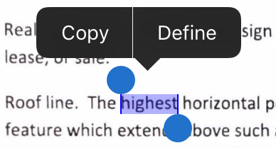
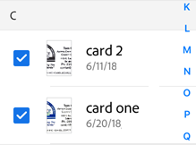
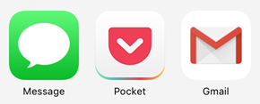
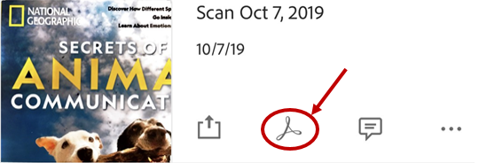
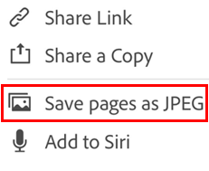
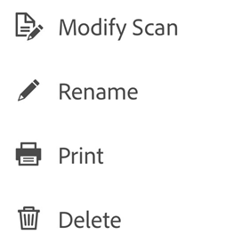
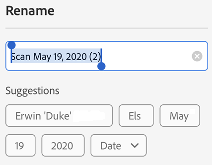
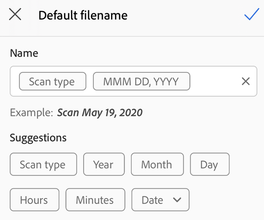
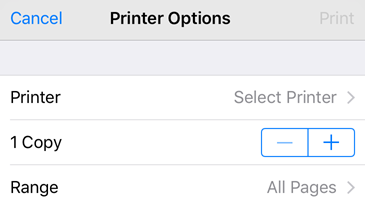

# Working with Scans {#working-with-scans}

Adobe Scan offers a rich set of features for working with your scans. You can: 

## Select and copy text {#select-and-copy-text}

You can select and copy text from any scan. Simply: 

1. Open a scan.
1. Long press the text you need to copy. 
1. Drag the handles to select the copy boundaries. 
1. Tap **Copy**.

   >[!NOTE]
   >
   > Optical character recognition (text recognition) must be enabled for this feature to work.

## Select multiple files {#select-multiple-files}

To delete or share more than one scan, select multiple files from the Home screen or All Scans list:

1. Tap  **> Select Multiple Items**. 
1. After the app enters multiple selection mode, tap files to select them. 
1. Tap  
1. From the top bar, tap  or 

## Add business card scans to contacts {#add-business-card-scans-to-contacts}

If you've selected **Business Card** during the scan or the scan app determines the scan is a business card, you can save the scan details directly to your contacts list. After the text recognition process completes, a Save Contact icon appears on the document card thumbnail. On the preview screen, you may also see a "This looks like a business card. . ." message.

To add the scan data to your contacts: 

1. Tap 
1. When the New Contact form appears, enter or edit the details. The business card thumbnail appears at the top so you can verify the information. 
1. Tap **Save**.

   >[!NOTE]
   >
   > If you've captured more than one business card in a single scan, you can select which cards to add to your contacts. 

## Share your scans {#share-your-scans}

You can share one or more saved scans in a number of ways. You can share a link to a file stored in Adobe Document Cloud, share a copy of the file with other apps on your device, email the file, and so on.

* When viewing a file, tap 
* For any file item or file thumbnail in the Recent list, tap 
* From the All Scans view, tap  and then tap  
* From the Recents view, tap any file's  and then tap 

.. * On iOS 11 and later, you can also share files from the Files app.

### Share from Recents {#share-from-recents}

For any file: 

1. Tap 
1. Choose one of the ways to share (file copy or link)
1. Choose a sharing app, and complete the workflow.

### Share a link from All Scans {#share-a-link-from-all-scans}

For any file: 

1. Tap 
1. Tap 
1. Choose one of the ways to share (file copy or link)
1. Choose a sharing app, and complete the workflow.

### Share multiple files {#share-multiple-files}

Select and share multiple files as follows:  

1. Tap the Home view's  icon. 
1. Tap **Select**
1. Tap the files to share. 
1. Tap 
1. Choose one of the ways to share (file copy or link), and complete the workflow.

### Email copies of scans {#email-copies-of-scans}

If you've [set up an email account](settings.md) on your iOS device, an email option appears in the context menus. You can email a link to a scan directly from the app as follows:

From the Recents list: 

1. Tap 
1. Choose one of the ways to share (file copy or link).
1. Complete the workflow.

From the All Scans list:

1. Tap   for any file (either on the thumbnail or in the file list). 
1. Choose one of the ways to share (file copy or link).
1. Complete the workflow.

## Comment and markup a scan {#comment-and-markup-a-scan}

While you could always copy a file to Acrobat and comment a file, improved integration with Acrobat enables commenting a shared file. With a file open:

1. Tap 
1. Add comments and markup in Acrobat. 
1. Tap **Done**. 

The shared file with comments is automatically saved in Adobe Scan.

## Open in Acrobat Readerx {#open-in-acrobat-readerx}

If you have Acrobat Reader installed, you can open a file directly and add comments, edit the file, and so on. 

1. From the Recent file list, tap  on any file. 
1. From All Scans, tap  on any file and then tap 
1. From an open file, tap  on any file and then tap 

## Save pages as JPEG {#save-pages-as-jpeg}

While files automatically save as PDF, you can also save individual pages as JPEG files to your gallery. 

1. From any file list, tap , or open a file and tap  
1. Tap **Save pages as JPEG**. 

Every page of your scan automatically saves to your gallery in JPEG format. 

## Create Fill & Sign forms {#create-fill-&-sign-forms}

Fill & Sign forms are PDF forms you can create on any platform, including mobile devices. Fill & Sign form fields are similar to annotations: you can select a form element from the form tool bar and tap anywhere on the PDF to place it. 

If you've installed Acrobat Reader, you can create a form from a scan: 

1. Open a file in Acrobat. 
1. Tap . 
1. Edit the file as needed. You can then add form fields such as text fields and check boxes. You can fill out the fields, or you can send the file to others for fill in. 

## Rename a file {#rename-a-file}

Rename a file during the scanning process by tapping  prior to saving it to PDF.

You can rename a file later via the Rename menu item from several places: 

1. When viewing a file, tap  next to the file name. 
1. From any file list, tap  for the file you want to rename, and tap **Rename**.
1. Enter a new name. 
1. Tap **Rename**.

### Renaming suggestions {#renaming-suggestions}

When the app recognizes document text, the rename dialog invoked from the review screen displays suggestions based on the recognized text. These suggestions only appear when OCR occurs on the device. Only date suggestions are available for server-based OCR (for example, with business cards). Note that suggestions do not appear when renaming a file from the Preview, Recent, or All Scans views. 

To use the suggestions, simply tap those you'd like to use. 

   >[!NOTE]
   >
   > Suggestions derive form the local, scanned document. Suggestions do not originate from, and are not stored on, Document Cloud. You can disable OCR entirely from the Preferences screen.

### Changing the default name {#changing-the-default-name}

While the default scan name is "Scan + Date", you can change the default name in renaming workflows for documents that recognize text. The new default name applies to all new scans. You can also set the default name from the app's preferences screen.

To change the default name: 

1. Scan a document with text. 
1. Tap the 
1. In the rename dialog, tap Edit Default Name. 
1. Enter a new default manually, or tap the suggestions.
1. Tap 

## Modify existing scans {#modify-existing-scans}

You can modify scans after they are converted to PDF. The feature allows you to organize, crop, and enhance scans at any time. To use this feature: 

1. Do one of the following: 

* Open a PDF scan in the preview screen. 
* For any thumbnail in the file list, tap 
 
1. Tap 
1. Modify your scan as needed. 
1. Tap **Save**.

Note that you cannot modify scanned files which have been altered outside of Adobe Scan. For example, if you have opened a scan in Acrobat and have added comments, added attachments, organized pages, and so on, Adobe Scan will not be able to modify that file.

   >[!NOTE]
   >
   > For details about editing scans, see [Scanning Documents](scan.md).

## Add photos to a scan {#add-photos-to-a-scan}

Document detection for the add-from-photos feature means the app tries to distinguish documents from selfies, artwork, and other non-document photos. By showing you document-specific images first, it's easier to find and work with what you actually need. Integration with the device photo library allows you to easily browse your photo library and add images to new or existing scans. 

To access this feature: 

1. Tap  on the capture screen or file browser. While reviewing a current scan, you can also tap  in the bottom menu and tap **Select from Photos**. Photos from last month appear by default.
1. If you don't see what you need, tap **Show More Documents** or **Show All Photos**. 
1. Tap a thumbnail to select one or more files. 
1. Tap the checkmark to finish adding the photo to your scan. 

## Printing {#printing}

Printing uses your device's printing capabilities. You can set up a printer ahead of time or at the time of printing.

1. Open a PDF. 
1. Tap  and then  
1. In the Printer Options dialog, select a printer.
1. Use the + and - buttons to set the number of copies to print.
1. Tap Print.

   >[!NOTE]
   >
   > Note that the printer must be AirDrop enabled. For more detail, see https://support.apple.com/en-us/HT201387.

