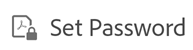
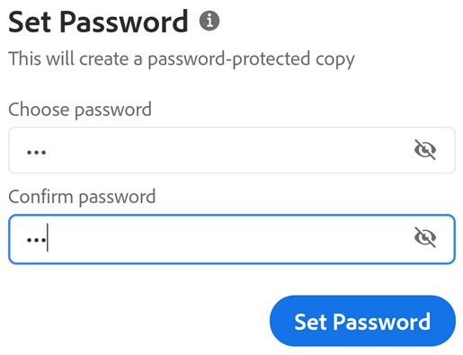
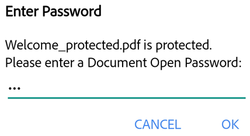

---

exl-id: 9dd2d202-d37f-4681-ba76-389b97e34400
---
# Password Protect PDF {#password-protect-pdf}

Subscribers to Adobe Acrobat Premium or Adobe Acrobat Pro DC can password protect PDFs by setting a document open password. 

When you create a password for a PDF, note the following: 

* The app creates a file copy named "(the file name)_protected" and saves that file to the Document Cloud. It does not protect or change the original file. 
* Actions which change the file are blocked on mobile devices, including Fill & Sign, commenting, and editing.
* You can use the restricted features with desktop Acrobat. 
* You can remove the password with desktop Acrobat (you must know the original password). 
* There is no separate password for edit. If a user can open a file, they can edit the file.

To password protect a file from within an open PDF or from any file list: 

1. Tap 
1. Tap 

   

1. Enter a password and confirm it.  *Use only supported characters*.
1. Tap **Set Password**. 

   

## Supported characters {#supported-characters}

When you create a password to password-protect a PDF, you must only use letters, numbers, and the supported characters listed below. Passwords with unsupported characters show an error dialog.

Supported characters: !, ", #, $, %, &, ', (, ), \*\, +, ,, -, ., /, 0, 1, 2, 3, 4, 5, 6, 7, 8, 9, :, ;, < , =, > , ?, @, A, B, C, D, E, F, G, H, I, J, K, L, M, N, O, P, Q, R, S, T, U, V, W, X, Y, Z, [, \\, ], ^, _, \`\, a, b, c, d, e, f, g, h, i, j, k, l, m, n, o, p, q, r, s, t, u, v, w, x, y, z, {, |, }, \~\

## Opening a protected file {#opening-a-protected-file}

To open a password protected file, you must know the password.

   >[!NOTE]
   >
   > There is no way to retrieve a forgotten password.

1. Open a protected file. 
1. Enter the password. 
1. Tap **OK**.

   
